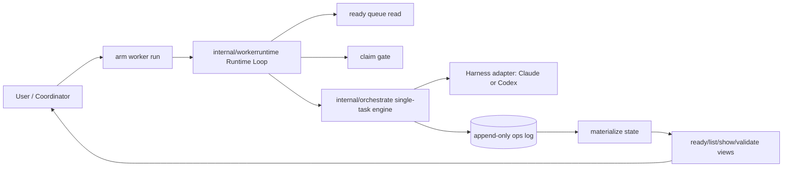
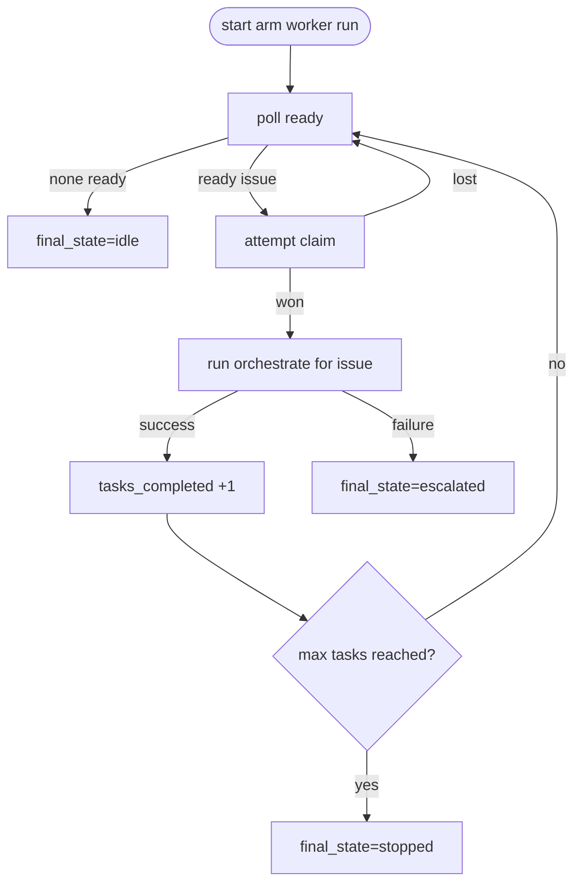

# Armature

**Git-Native Work Orchestration for Multi-Agent AI Coordination**

> "Every agent decision. Every requirement cited. All of it in git."

---

## Overview

Armature is a git-native work orchestration system for AI coding agents. It solves two problems that compound as teams scale: agents that lose context between sessions and forget architectural decisions, and AI-generated work with no traceable record connecting decisions back to the requirements that originated them.

Multiple agents working in the same codebase step on each other, duplicate effort, and produce changes no one can audit after the fact. Armature coordinates them through a typed task DAG with append-only event-sourced logs — merge-conflict-free by construction, because each worker writes exclusively to its own log file. Every claim, transition, and outcome is structurally cited back to its source document.

Armature ships skills in the agentskills.io format covering every role in the workflow — planner, coordinator, worker, and auditor — usable by any compatible tool. Your agents participate immediately, no custom prompt engineering required.

All state lives in git. No database, no server, no daemon. A single Go binary (`arm`) and git are the only requirements.

## Key Features

- **Source Traceability**: Structural citations link every claim, transition, and agent decision to its originating source document. The result is a full, inspectable audit trail — useful for sign-off review, compliance, and understanding why any given decision was made.

- **DAG-Structured Context**: Requirements decompose into a typed dependency graph (epic → story → task). Each agent receives a deterministic context assembly of 650–1,600 tokens using a layered algorithm — core task definition, acceptance criteria, and scope are always preserved; when the token budget is exceeded, lower-priority context (sibling outcomes, prior notes) is dropped first, preserving the highest-signal content.

- **Merge-Conflict-Free by Construction**: Uses Mergeable Replicated Data Types (MRDT, a variant of CRDTs) with a single-writer principle — each worker appends only to its own log, no worker ever writes another's. Current state is derived by replay. Merge conflicts on coordination state are architecturally impossible.

- **Zero Infrastructure**: Git-only. No persistent server, no database, no daemon. All coordination state is stored as append-only JSONL event journals — plain text and always inspectable, not meant to be edited directly. A single Go binary (`arm`) and git are the only requirements.

- **Workflow Skills Included**: Ships skills in the agentskills.io format for every workflow role — planner, coordinator, worker, and auditor — usable by any compatible tool. No custom prompt engineering required to wire your agents in.

## Runtime Architecture



## Runtime Flow



## Installation

### Prerequisites

- **Git** (v2.25+ for sparse checkout support)
- **Go** (for building from source)

### Building from Source

```bash
git clone https://github.com/scullxbones/armature.git
cd armature
make install
```

This will build the `arm` binary and install it to `~/.local/bin/arm`. Ensure `~/.local/bin` is in your `PATH`.

---

## 5-Minute Quickstart

### 1. Initialize a Repository

From your project root, run:

```bash
arm init
```

Armature will detect if your repository has branch protection and set up either a dual-branch (`_armature` orphan branch) or single-branch mode accordingly.

### 2. Add Requirements

Register source documents (PRDs, architecture docs) that define your project's work:

```bash
arm sources add docs/armature-prd.md
arm sources sync
```

### 3. Decompose into Tasks (via AI)

Generate a decomposition context for your AI agent to break down requirements into a task DAG:

```bash
arm decompose-context --sources src-001 > context.json
# Feed context.json to your AI agent to produce plan.json
arm decompose-apply plan.json
```

### 4. Run the Worker Runtime (Default)

Start the runtime loop and let it drain ready work:

```bash
arm worker run
```

Use single-task orchestration when you need manual control:

```bash
arm orchestrate --issue <issue-id>
```

### 5. Complete and Verify

Once you've finished the code changes, transition the task to `done`:

```bash
arm transition <issue-id> done --outcome "Brief summary of work"
```

Armature will automatically detect when your code is merged into the main branch to promote the task to `merged`.

## Provider Smoke Tests

Runbook: [docs/provider-smoke-tests.md](docs/provider-smoke-tests.md)

---

## License

Armature is open-source software licensed under the Apache 2.0 License.
