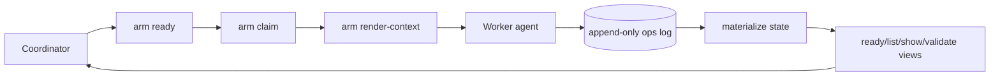
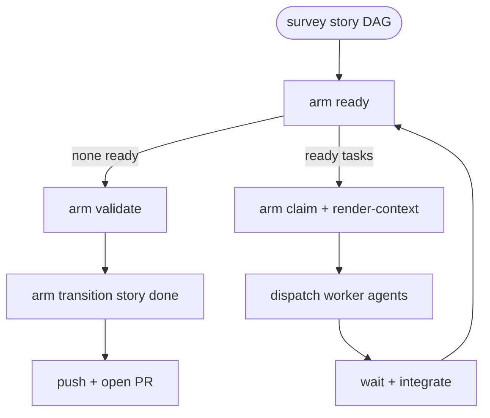

# Armature

**Git-Native Work Orchestration for Multi-Agent AI Coordination**

> "Every agent decision. Every requirement cited. All of it in git."

---

## Overview

Armature is a git-native work orchestration system for AI coding agents. It solves two problems that compound as teams scale: agents that lose context between sessions and forget architectural decisions, and AI-generated work with no traceable record connecting decisions back to the requirements that originated them.

Multiple agents working in the same codebase step on each other, duplicate effort, and produce changes no one can audit after the fact. Armature coordinates them through a typed task DAG with append-only event-sourced logs — merge-conflict-free by construction, because each worker writes exclusively to its own log file. Every claim, transition, and outcome is structurally cited back to its source document.

Armature ships skills in the agentskills.io format covering every role in the workflow — planner, coordinator, worker, and auditor — usable by any compatible tool. Your agents participate immediately, no custom prompt engineering required.

All state lives in git. No database, no server, no daemon. A single Go binary (`arm`) and git are the only requirements.

## Key Features

- **Source Traceability**: Structural citations link every claim, transition, and agent decision to its originating source document. The result is a full, inspectable audit trail — useful for sign-off review, compliance, and understanding why any given decision was made.

- **DAG-Structured Context**: Requirements decompose into a typed dependency graph (epic → story → task). Each agent receives a deterministic context assembly of 650–1,600 tokens using a layered algorithm — core task definition, acceptance criteria, and scope are always preserved; when the token budget is exceeded, lower-priority context (sibling outcomes, prior notes) is dropped first, preserving the highest-signal content.

- **Merge-Conflict-Free by Construction**: Uses Mergeable Replicated Data Types (MRDT, a variant of CRDTs) with a single-writer principle — each worker appends only to its own log, no worker ever writes another's. Current state is derived by replay. Merge conflicts on coordination state are architecturally impossible.

- **Zero Infrastructure**: Git-only. No persistent server, no database, no daemon. All coordination state is stored as append-only JSONL event journals — plain text and always inspectable, not meant to be edited directly. A single Go binary (`arm`) and git are the only requirements.

- **Workflow Skills Included**: Ships skills in the agentskills.io format for every workflow role — planner, coordinator, worker, and auditor — usable by any compatible tool. No custom prompt engineering required to wire your agents in.

## Runtime Architecture


```mermaid
flowchart LR
    U[Coordinator] --> R[arm ready]
    R --> CL[arm claim]
    CL --> CTX[arm render-context]
    CTX --> W[Worker agent]
    W --> OP[(append-only ops log)]
    OP --> M[materialize state]
    M --> V[ready/list/show/validate views]
    V --> U
```

## Coordinator Flow


```mermaid
flowchart TD
    S([survey story DAG]) --> R[arm ready]
    R -->|none ready| V[arm validate]
    R -->|ready tasks| C[arm claim + render-context]
    C --> D[dispatch worker agents]
    D --> I[wait + integrate]
    I --> R
    V --> T[arm transition story done]
    T --> PR[push + open PR]
```

## Installation

### Prerequisites

- **Git** (v2.25+ for sparse checkout support)
- **Go** 1.26+ (for `go install` or building from source)

### Windows is not supported

Armature runs on **Linux and macOS only**. Windows is not supported. Gaps that remain:

- **File locking:** the supported path is `flock(2)` on a local git common dir. `LockFileEx` already exists in `internal/filelock/filelock_windows.go` and is built by `make crosscompile`, but that path is unvalidated; Windows remains unsupported.
- **Per-command environment:** POSIX `VAR=x arm …` is one process; PowerShell `$env:VAR` persists for the session, which is why env is not worker identity.
- **Worker-id filenames:** case-insensitive APFS/NTFS plus reserved `con`/`aux`/`nul` names. Validation rejects those even though Windows is unsupported.

`docs/design/architecture.md` still lists Windows in a packaging matrix; that row is stale for support claims.

### Released binaries

Download the `arm` archive for your OS/arch from
[GitHub Releases](https://github.com/scullxbones/armature/releases),
verify the checksum, unpack it, and place `arm` on your `PATH` (for example
`~/.local/bin/arm`).

### go install

```bash
GOBIN="${GOBIN:-$HOME/.local/bin}"
export GOBIN
mkdir -p "$GOBIN"
go install github.com/scullxbones/armature/cmd/armature@latest
mv "$GOBIN/armature" "$GOBIN/arm"
```

`go install` names the binary after the package directory (`armature`); rename
it to `arm` so docs and skills match. Pin a release instead of `@latest` when
you need a fixed version (for example `@v0.1.0` after that tag exists).

### Building from source

```bash
git clone https://github.com/scullxbones/armature.git
cd armature
make install
```

This builds `arm` and installs it to `~/.local/bin/arm`. Ensure `~/.local/bin`
is in your `PATH`.

---

## 5-Minute Quickstart

Run these commands from a clean git repository that already has a committed
requirements doc at `docs/requirements.md`. `scripts/quickstart_check.sh`
extracts every `bash` fence in this section and runs them verbatim in a
scratch repo in CI.

`arm bootstrap` creates the orphan `_armature` branch and an ops worktree at
`.armature/`. Coordination state (ops logs, materialized issues, config) lives
at the root of that worktree. Older clones used a dual layout (`.arm/` worktree
containing an inner `.armature/` state dir); bootstrap migrates those to the
single `.armature/` worktree. Bootstrap also deploys bundled skills — there is
no separate skill-install step.

```bash
arm bootstrap
arm worker-init --check || arm worker-init

arm sources add --url docs/requirements.md --type filesystem
arm sources sync
SOURCE_UUID=$(arm sources verify | awk '/OK/{print $1; exit}')
test -n "$SOURCE_UUID"

# In production, feed context.json to an agent to produce plan.json.
# The minimal plan below is what CI verifies so the path stays runnable.
arm dag context --sources "$SOURCE_UUID" > context.json
cat > plan.json <<EOF
{
  "version": 1,
  "title": "Quickstart demo plan",
  "issues": [
    {
      "id": "DEMO-S1",
      "title": "Demo story",
      "type": "story",
      "scope": "docs/requirements.md",
      "priority": "high",
      "dod": "Greeting shipped",
      "parent": "",
      "blocked_by": [],
      "acceptance": ["greeting done"],
      "source": "$SOURCE_UUID"
    },
    {
      "id": "DEMO-S1-T1",
      "title": "Write greeting",
      "type": "task",
      "scope": "hello.txt",
      "priority": "high",
      "dod": "hello.txt contains Hello",
      "parent": "DEMO-S1",
      "blocked_by": [],
      "acceptance": ["hello.txt exists"],
      "source": "$SOURCE_UUID"
    }
  ]
}
EOF

arm dag apply --plan plan.json
arm dag transition --issue DEMO-S1
arm dag transition --issue DEMO-S1-T1

arm ready
arm claim DEMO-S1-T1 --worktree
arm render-context DEMO-S1-T1 --format agent > task-context.txt

# Implement in the claim worktree, then mark done.
# --force is required because the done-branch check reads the primary
# checkout (often still main) even when the claim worktree is on task/*.
cd .worktrees/DEMO-S1-T1
printf 'Hello\n' > hello.txt
git add hello.txt
git commit -m "feat(DEMO-S1-T1): add greeting"
arm transition DEMO-S1-T1 --to done --outcome "Wrote hello.txt greeting for the quickstart demo" --force
```

After the change lands on `main`, Armature promotes the task from `done` to
`merged` (self-reported completion and confirmed-on-main stay distinct).

## Why Armature?

Comparing GitHub Issues plus prompts, markdown task lists, or other
agent-orchestration tools? Read **[Why Armature](docs/why-armature.md)** for an
honest trade-off table, the paved road vs escape-hatch `create` path, and why
**draft ≠ ready** (cite + `dag transition` before `arm ready` fills).

Inspect a real completed trail without running anything:
[`examples/completed-story/`](examples/completed-story/) (`TOPTIER-S7-T1`,
[PR #308](https://github.com/scullxbones/armature/pull/308)).

## Documentation

- **[Why Armature](docs/why-armature.md)** — Alternatives comparison and adopter footguns from v0.1.0 dogfood
- **[Examples](examples/README.md)** — Completed-story artifact trail (source, plan, ops, render-context, assessment)
- **[Core Concepts](docs/concepts.md)** — Agent reference for the 8 operational concepts: ops log & materialization, worker identity, claim lifecycle, DAG hierarchy, citations, confidence levels, branch modes, and decomposition
- **[Getting Started](docs/getting-started.md)** — Setup workflow and first task
- **[Commands Reference](docs/commands.md)** — Complete command documentation
- **[Configuration Reference](docs/configuration.md)** — TTL, token budgets, hooks, and mode settings
- **[Use Cases](docs/use-cases.md)** — Persona-based workflow walkthroughs (lone wolf, gatekeeper, team coordinator, etc.)
- **[Validation Codes](docs/validation-codes.md)** — Error and warning reference (E1–E12, W1–W11)
- **[Provider Smoke Tests](docs/provider-smoke-tests.md)** — Testing source document providers

---

## License

Armature is open-source software licensed under the Apache 2.0 License.
