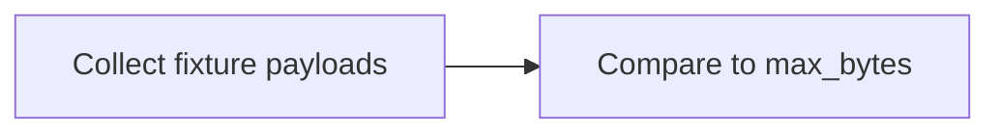
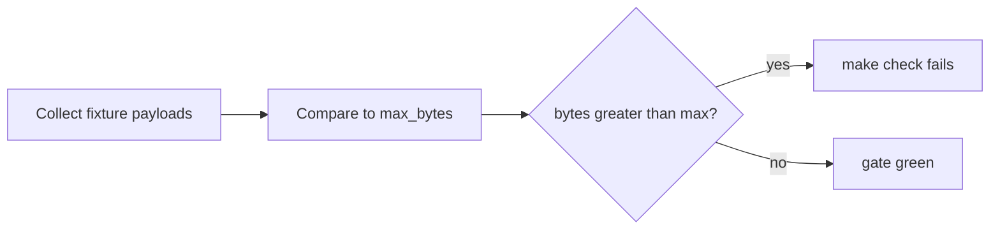
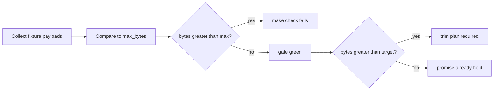

# Context budgets

A runtime budget is a byte cap on one priced CLI payload.

In Armature, the inventory is the same one `make context-report` prices: structured stdout for `list`, `ready`, `show`, `render-context`, and `review`, plus the fixture `render-context.bundle`. Tokens are not a second cap. They are `bytes / 4`, the `token_budget` heuristic, shown so a reader can compare to render-context.

Skill trees and static docs are not rows here. Agents spend tokens on live command output and assembled context. Those files are not the runtime cost of the main-path calls.

Budgets live in `internal/contextreport/budgets.json`. Each row is one artifact: `path`, `class`, `max_bytes`, and `target_bytes`.

`max_bytes` is the enforceable cap. `make check` fails when measured bytes go over it.

`target_bytes` is the customer promise. It is a named number, not "whatever we measured today." Seeding `max_bytes` and `target_bytes` both at the live size, with no other promise, is not a cap. That was the failure mode of the first T2 attempt.

Class is for reporting. The gate still fails per artifact, not per class.

## How max and target differ







When measured size is already under the promise, set `max_bytes` equal to `target_bytes`. The gate then *is* the promise. Growth is allowed until that number, then it fails.

When measured size is still above the promise, keep `max_bytes` high enough that today's fixture stays green. Record a dated trim plan for that path. Shrink `max_bytes` as the payload shrinks. Do not raise it in ordinary commits.

## How the ratchet works

A budget may only shrink in ordinary commits. Smaller `max_bytes` is always allowed.

Raising `max_bytes` is a reviewable exception. The raise must be a dedicated commit that touches only `internal/contextreport/budgets.json`. `make check` does not enforce that commit shape. Reviewers do. `RaisedBudgets` lists paths whose `max_bytes` grew so a reviewer can see the exception.

## How the gate fails

`Enforce` compares `Collect` (fixture-measured bytes) to the checked-in file. `make check` runs the unit suite once via `coverage`. `TestCheckedInContextBudgetsHold` loads the real repo and the budgets file. If any artifact is over `max_bytes`, that test fails, so `make check` fails.

The error groups over-budget rows by class:

```
context budget gate failed
over budget (grouped by class):
  invocation:
    list: 2049 bytes > budget 2048
```

The gate also fails when a measured path has no budget, when a budget path is not measured, or when `class` disagrees with the report. Those keep the file from drifting away from the T1 inventory.

`TestBudgetGateFailsOverBudget_REQ_NXTTN_S3_T2` is the acceptance test for the over-budget case. It uses an in-memory fixture, not a live DAG.

`TestRuntimeBudgetCapsAreExplicitTargets_REQ_NXTTN_S3_T2` is the acceptance test that every row names a `target_bytes` promise and is not a measured-size-only seed. When measured bytes exceed `target_bytes` while staying under `max_bytes`, that test requires `HasDatedTrimPlan` to find a heading for that path. The phrase "trim plan", a date, or the path appearing in the table is not enough.

## Named promises (2026-09-10)

These numbers are the product caps. They are not the fixture's current size.

| path | class | target_bytes | max_bytes | why this number |
|---|---|---:|---:|---|
| list | invocation | 2048 | 2048 | Compact issue array. Agents scan it on the paved road. Two kilobytes is the promise for the fixture graph. |
| ready | invocation | 1024 | 1024 | Ready queue should stay a short list. One kilobyte is the promise. |
| show | invocation | 2048 | 2048 | One issue record. Not the whole DAG. |
| render-context | invocation | 16000 | 16000 | Default `--budget` is 4000 tokens. Character budget is tokens times 4. The priced invocation is truncated to that. |
| review | invocation | 4096 | 4096 | Review prepare JSON for one fixture delivery. Four kilobytes is the promise. |
| render-context.bundle | bundle | 16000 | 16000 | Same character budget as render-context. The untruncated fixture bundle must not exceed the default character budget. |

Measured fixture sizes on 2026-09-10 (T1 head `cf07d09c`): list 475, ready 189, show 375, render-context 1164, review 1080, render-context.bundle 1163. Every row is under its target. No trim cycle is open.

## Dated trim plan

No path is above target as of 2026-09-10. If a later measurement lands above `target_bytes`, add a dated subsection here before raising or holding a high `max_bytes`. `HasDatedTrimPlan` matches a real markdown heading of the form `### YYYY-MM-DD <path>`. Name the path, the measured bytes, the target, and the cut that brings it under. Fenced examples do not count. Example shape (this fence is not a plan):

```
### 2026-10-01 render-context.bundle (measured M > target 16000)

max_bytes held at M until the assembler drops unused layers from the fixture bundle.
Owner: the next NXTTN-S3 follow-up that touches assemble/render.
```

## How to reseed

1. Run `make context-report` (or `arm context-report --repo . --format json`).
2. If measured bytes are still under `target_bytes`, leave `max_bytes` at the promise. Do not copy measured size into `max_bytes` unless you also keep a distinct `target_bytes` and, when measured is above target, a dated trim plan.
3. Do not raise `max_bytes` in the same commit as a code or docs change.
4. If you must raise, make a follow-up commit that edits only `internal/contextreport/budgets.json`. Say why in the commit body.
5. Re-run `go test ./internal/contextreport -count=1 -run 'TestCheckedInContextBudgetsHold|TestRuntimeBudgetCapsAreExplicitTargets'`.
6. Re-run `make check` before you push.

Shrinking after a trim does not need a special commit. Mix it with the trim.

## Wiring note

The task file list is `docs/context-budgets.md`, `internal/contextreport/budget.go`, `internal/contextreport/budget_test.go`, and `internal/contextreport/budgets.json`. No Makefile change. `make check` already runs this package through `coverage`. A second `check` prerequisite would run the suite twice and break the single-run rule in `docs/design/gate-efficiency.md` (D3). `make context-report` from NXTTN-S3-T1 stays the measurement command.
