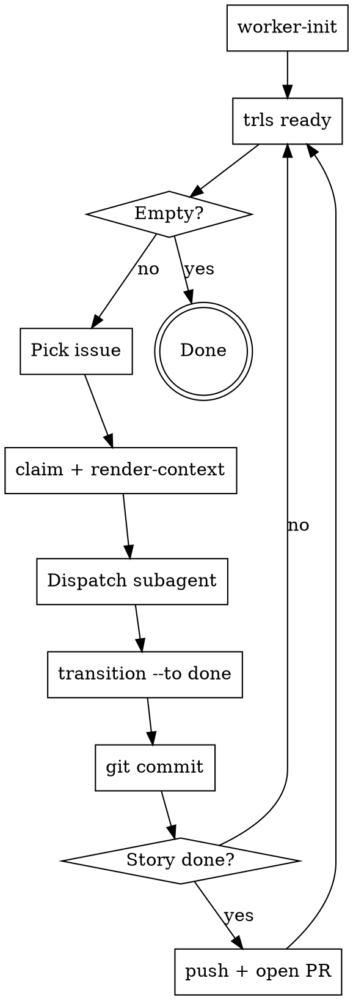

# Trellis Worker Loop

Trellis is the source of truth for what to work on and how. Do not read external plan files during execution. `render-context` output is your complete task specification.

## Prerequisites

`trls` must be on your PATH. Run `make install` from the trellis repo root if it isn't:

```
make install   # installs to ~/.local/bin/trls
```

If `trls` is not found, stop and resolve this before proceeding.

## The Loop



## Step-by-Step

### 1. Initialize
```
trls worker-init
```
Run once per agent session. Registers a unique worker ID in git config.

### 2. Find Ready Work
```
trls ready
```
Lists unblocked, unclaimed issues. If empty, all work is done or blocked — stop.

### 3. Claim and Assemble Context
```
trls claim --issue ISSUE-ID
trls render-context --issue ISSUE-ID --budget 4000
```
Claim before reading context. The `render-context` output is your complete task specification — it contains the issue description, definition of done, blocker outcomes, parent chain, decisions, and notes.

**Do not open plan files. Do not read docs/superpowers/plans/. The render-context output is sufficient.**

### 4. Dispatch Subagent

Dispatch a subagent with:
- The full `render-context` output as the task description
- The `trls` skill loaded for API reference

The subagent should:
- Record progress with `trls note --issue ID --msg "..."`
- Record decisions with `trls decision --issue ID --topic X --choice Y --rationale Z`
- Call `trls heartbeat --issue ID` for long-running work (max once/minute)

### 5. Complete and Commit

```
trls transition --issue ISSUE-ID --to done --outcome "what was accomplished"
git add -p   # stage relevant changes
git commit -m "feat(ISSUE-ID): brief description of what was implemented"
```

Record a concrete outcome. Commit immediately after each task — small focused commits are easier to review.

**Commit message format:** `<type>(<ISSUE-ID>): <description>`
Types: `feat`, `fix`, `refactor`, `test`, `docs`

Then return to step 2.

### 6. Story Complete — Push and PR

When `trls ready` returns empty and the story's tasks are all done, push and open a PR:

```
git push -u origin HEAD
# Open a PR targeting your main/base branch
# PR title: the story title
# PR body: list each task ISSUE-ID and its outcome
```

**One PR per story** — not per task (creates review overhead), not per epic (too large to review). Story-level PRs give reviewers clear scope.

## Valid Transition Targets

| Target | When |
|---|---|
| `done` | Work complete |
| `blocked` | Cannot proceed, external dependency |
| `cancelled` | Work abandoned |

**Valid status values use hyphens:** `in-progress`, `done`, `cancelled`, `blocked`. Underscores are rejected.

## If `trls ready` Returns Nothing

- Check for blocked issues: state may be blocked by incomplete dependencies
- Check issue types: `ready` shows `task`, `feature`, and `story` types
- All work may genuinely be complete

## Common Mistakes

| Mistake | Fix |
|---|---|
| `trls: command not found` | Run `make install`, ensure `~/.local/bin` is on PATH |
| Reading plan files for task instructions | Use `render-context` output only |
| Using `in_progress` (underscore) | Use `in-progress` (hyphen) |
| Skipping `worker-init` | Required — ops without worker ID will fail |
| Skipping heartbeat on long tasks | Claim expires after TTL; other workers can steal it |
| Skipping commit after task | Small commits make review and revert tractable |
| Auto-pushing after every task | Push once per story to avoid noisy remote history |
