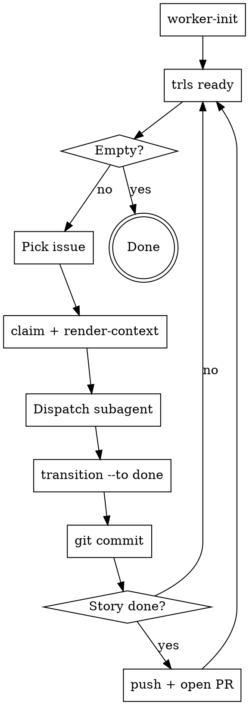

<!-- CANONICAL SOURCE: edit this file, not .claude/skills/trls-worker/SKILL.md — run `make skill` to regenerate the deployed copy -->

# Trellis Worker Loop

Trellis is the source of truth for what to work on and how. Do not read external plan files during execution. `render-context` output is your complete task specification.

## Prerequisites

`trls` must be on your PATH. Run `make install` from the trellis repo root if it isn't:

```
make install   # installs to ~/.local/bin/trls
```

If `trls` is not found, stop and resolve this before proceeding.

## The Loop



## Step-by-Step

### 1. Initialize
```
trls worker-init --check || trls worker-init
trls doctor
```
Run `worker-init` once per machine/clone — the worker ID persists in local git config across sessions. `--check` is a no-op if the ID is already set. Re-running `worker-init` without `--check` generates a new UUID, which is almost never what you want.

Run `trls doctor` after init to verify repo health (no broken parent refs, no orphaned ops, no dependency cycles). Fix any errors before claiming work.

### 2. Find Ready Work
```
trls ready
```
Lists unblocked, unclaimed issues. If empty, all work is done or blocked — stop.

### 3. Claim and Assemble Context
```
trls claim ISSUE-ID
trls render-context ISSUE-ID --budget 4000
```
Claim before reading context. The `render-context` output is your complete task specification — it contains the issue description, definition of done, blocker outcomes, parent chain, decisions, and notes.

**Do not open plan files. Do not read docs/superpowers/plans/. The render-context output is sufficient.**

### 4. Dispatch Subagent

Dispatch a subagent with:
- The full `render-context` output as the task description
- The `trls` skill loaded for API reference

The subagent should:
- Record progress with `trls note ID --msg "..."`
- Record decisions with `trls decision ID --topic X --choice Y --rationale Z`
- **Call `trls heartbeat ID` for any work taking more than a few minutes — maximum once per minute.** Claims expire after the TTL; without periodic heartbeats another worker may steal the claim. Issue heartbeat calls at natural checkpoints (e.g. after each test run, after each file written).
- **Cite every issue it touches or creates** — before returning, run `trls source-link` for any issue that has a recoverable source doc, or `trls accept-citation --ci` if no source exists. Do not leave issues uncited.

### 5. Complete and Commit

```
trls transition ISSUE-ID --to done --outcome "what was accomplished"
git add <code files...> .issues/   # always include .issues/ — ops must travel with code
git commit -m "feat(ISSUE-ID): brief description of what was implemented"
```

Record a concrete outcome. Commit immediately after each task — small focused commits are easier to review.

**Pro-tip: Bundled Workflow**
To avoid forgetting `.issues/` or the commit, combine these into a single command or use a shell alias:
```bash
trls transition ISSUE-ID --to done --outcome "..." && git add . .issues/ && git commit -m "feat(ISSUE-ID): ..."
```

**Always stage `.issues/` alongside code files.** Every `trls` command (claim, transition, note, decision, heartbeat) writes ops to `.issues/`. If you omit `.issues/` from the commit, those ops are left behind and will not be delivered with the code.

**Commit message format:** `<type>(<ISSUE-ID>): <description>`
Types: `feat`, `fix`, `refactor`, `test`, `docs`

Then return to step 2.

### 6. Story Complete — Sync, Push, and PR

When `trls ready` returns empty and the story's tasks are all done:

**a. Verify citation coverage, then transition the story:**
```
trls validate   # must show COVERAGE: N/N cited with no ERROR lines
trls transition STORY-ID --to done --outcome "story-level summary"
git status   # check for unstaged .issues/ changes
git add .issues/ && git commit -m "chore(STORY-ID): sync trellis state"
```

If `trls validate` shows uncited nodes, source-link or accept-citation them before transitioning.

Story/epic-level transitions, and any notes or decisions recorded between task commits, generate ops that have no code to bundle with. This mop-up commit ensures nothing is left behind before pushing.

**b. Push and open a PR:**
```
git push -u origin HEAD
# Open a PR targeting your main/base branch
# PR title: the story title
# PR body: list each task ISSUE-ID and its outcome
```

**One PR per story** — not per task (creates review overhead), not per epic (too large to review). Story-level PRs give reviewers clear scope.

## Valid Transition Targets

| Target | When |
|---|---|
| `done` | Work complete |
| `blocked` | Cannot proceed, external dependency |
| `cancelled` | Work abandoned |

**Valid status values use hyphens:** `in-progress`, `done`, `cancelled`, `blocked`. Underscores are rejected.

## If `trls ready` Returns Nothing

- Check for blocked issues: state may be blocked by incomplete dependencies
- Check issue types: `ready` shows `task`, `feature`, and `story` types
- All work may genuinely be complete

## Parallel Subagents (Advanced)

By default the worker loop is sequential: claim → dispatch → commit → repeat.
When tasks are **independent** (no shared files, no ordering dependency), you can
dispatch subagents in parallel using git worktrees. To avoid merge conflicts on
the ops log, each subagent must write to its own log slot:

    # Set before dispatching each subagent
    export TRLS_LOG_SLOT=a   # subagent A
    export TRLS_LOG_SLOT=b   # subagent B

**Rules:**
- The orchestrator always runs with `TRLS_LOG_SLOT` **unset** (claims and story
  transitions go to the plain `<worker-id>.log`).
- Each parallel subagent sets a distinct, short slot name (`a`, `b`, `c`, or the
  issue ID) before invoking any `trls` command.
- Slot names must be unique within a parallel batch — reusing a slot across two
  concurrent agents defeats the purpose.
- Slot files (`<worker-id>~<slot>.log`) are permanent. They are committed
  alongside code files exactly like the plain log: `git add .issues/ code/`.
- After the batch, run `trls validate` and `make check` from the orchestrator
  (with `TRLS_LOG_SLOT` unset) before pushing.

**Common mistake:** Setting `TRLS_LOG_SLOT` in the orchestrator's shell and
forgetting to unset it — orchestrator ops land in a slot file and may not be
seen by `trls ready` until materialization catches up.

## Batch Strategy (Advanced)

When a task involves a large number of files (e.g. refactoring 10+ files), do not
attempt to process them all in a single turn. This leads to incomplete work and
high token usage. Instead:

1.  **Build a Manifest:** Use `grep --names-only` or `glob` to find all files that
    need changes. Save this list to a temporary file or a note.
2.  **Process in Chunks:** Process the files in small batches (e.g. 3-5 files at a
    time).
3.  **Verify each Chunk:** Run tests/linting after each chunk to ensure no
    regressions were introduced.
4.  **Heartbeat:** Call `trls heartbeat ID` after each chunk.
5.  **Final Review:** Once all files are processed, run a final global check
    before transitioning the task to `done`.

## Common Mistakes

| Mistake | Fix |
|---|---|
| `trls: command not found` | Run `make install`, ensure `~/.local/bin` is on PATH |
| Reading plan files for task instructions | Use `render-context` output only |
| Using `in_progress` (underscore) | Use `in-progress` (hyphen) |
| Skipping `worker-init` on a fresh clone | Required once per clone — ops without worker ID will fail |
| Running `worker-init` every session | Generates a new UUID each time, creating phantom workers; use `--check` to verify instead |
| Skipping heartbeat on long tasks | Claim expires after TTL; other workers can steal it |
| Skipping commit after task | Small commits make review and revert tractable |
| Omitting `.issues/` from `git add` | Ops left behind, not delivered with code; always include `.issues/` in every commit |
| No mop-up commit before push | Story/epic transitions and between-task ops never get committed; run `git add .issues/ && git commit` before `git push` |
| Auto-pushing after every task | Push once per story to avoid noisy remote history |
| Leave issues uncited | Run `trls source-link` or `trls accept-citation --ci` before the subagent returns |
| Repeating `transition` then `commit` manually | Use a bundled command or alias: `trls transition ID ... && git add . .issues/ && git commit -m ...` |
| Skipping `trls validate` at story close | Citation debt accumulates silently; validate before transitioning the story |

| Scope overlap WARNING on `trls validate` | Add `trls link --source ISSUE-A --dep ISSUE-B` so overlapping tasks execute serially, not in parallel |
| MISSING entries in `trls sources verify` | Run `trls sources sync` to fetch and fingerprint; re-run `trls sources verify` until all show OK |
