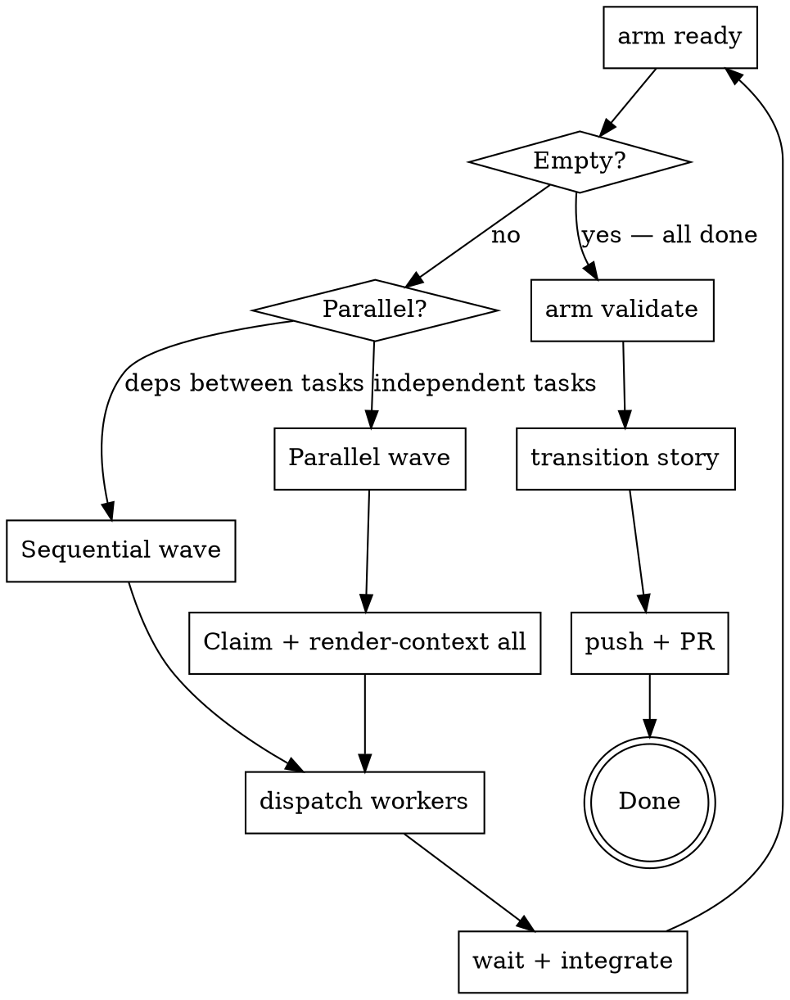

# Armature Coordinator

The coordinator manages execution flow — it does not implement features itself.
Its job is to survey the story DAG, dispatch workers for each wave of ready tasks,
and close the story when all tasks are done.

## Prerequisites

1. If `arm` is not found, stop and resolve this before proceeding.

2. **Worker identity required.** Run `arm worker-init` once per clone before claiming any tasks:
   ```bash
   arm worker-init --check || arm worker-init
   ```
   `arm claim` calls `resolveWorkerAndLog`, which fails with "worker not initialized" if no worker ID is set in git config.

3. Understand the story DAG before dispatching. Run:
   ```
   arm list --parent STORY-ID          # all tasks + statuses
   arm list --status blocked           # diagnose any blockers
   arm doctor                          # repo health check
   ```
   Fix any `doctor` errors before claiming work.

## DAG Hygiene Mandate

**`arm validate` and `arm doctor` must exit clean at all times.** This is non-negotiable.

Before dispatching any worker and after each wave completes, run:
```bash
arm validate       # zero ERRORs; all issues cited
arm doctor        # zero errors; no broken refs, orphaned ops, or cycles
```

If either exits non-zero, stop. Fix the reported issues before proceeding. Treat DAG decay the same way you treat failing tests — it is a blocker, not a warning to ignore.

Warnings from other stories must be resolved, not ignored. If `arm doctor` reports a D1 (commits referencing non-done issues) or D2 (stale claims) from unrelated work, clean them up before starting your coordination wave. DAG health is cumulative.

---

## The Coordinator Loop



## Step-by-Step

### 1. Survey the Story and Create a Feature Branch

```bash
arm list --parent STORY-ID
arm doctor
git checkout -b feat/STORY-ID   # create the story branch NOW, before any worker is dispatched
```

Identify which tasks are `open` and which have `blocked_by` dependencies. Group
tasks into waves — tasks within the same wave have no dependencies on each other
and can run in parallel. Tasks in different waves must run sequentially.

**Create the feature branch before dispatching any worker.** This is the shared
story branch, but workers do not commit to it directly: each worker commits to
its own per-task branch (`task/TASK-ID`) in an isolated worktree created by
`arm claim --worktree` (see Dispatch Protocol steps 4-5). The coordinator later
merges each completed task branch into `feat/STORY-ID` (see "After Workers
Return", section b). If the story branch does not exist before dispatch, there
is nothing for the coordinator to merge task branches into, and the story
cannot be reviewed via PR.

### 2. Find Ready Work

```bash
arm ready                              # unblocked, unclaimed tasks
```

If `arm ready` returns nothing and not all tasks are `done`, check for
dependency cycles or stalled in-progress tasks:
```bash
arm ready --explain                    # why each open task is NOT ready (blocked/claimed/missing dep)
arm list --status in-progress          # claims that may have expired
arm list --status blocked              # diagnose blockers
```

`arm ready --explain` prints a per-task diagnosis for every open task that
did not make it into the ready queue. Use it as the first step whenever the
queue looks unexpectedly empty.

### 3. Record Wave Manifest

Before dispatching any worker, record the wave manifest so the verification gate
has a stable baseline to diff against:

```bash
WAVE_TASK_IDS="TASK-A TASK-B ..."      # exact IDs in dispatch order
WAVE_BASE_SHA=$(git rev-parse HEAD)    # commit HEAD at wave start
WAVE_BRANCH=$(git rev-parse --abbrev-ref HEAD)  # story feature branch

# Classify wave type (determines which verification profile to run)
WAVE_TYPE=docs-skill-only              # default; promoted below if code files present
```

**Wave type auto-promotion rule:** inspect the ready-task scope fields. If any
task touches files matching `*.go`, `go.mod`, `go.sum`, `Makefile`, `cmd/**`,
or `internal/**` outside of `internal/skillsembed/`, set `WAVE_TYPE=code`.
A wave is docs-skill-only only when every changed file is a `SKILL.md`,
`references/*.md`, or other non-compiled documentation.

```bash
# Collect scope files from arm render-context output for each task in WAVE_TASK_IDS,
# or use `git diff --name-only "$WAVE_BASE_SHA"..HEAD` after workers return.
# Example: auto-promote based on task scope fields before dispatch:
WAVE_SCOPE_FILES=$(arm ready --parent STORY-ID --format json | python3 -c "import sys,json; [print(f) for t in json.load(sys.stdin) for f in t.get('scope',[])]")

if echo "$WAVE_SCOPE_FILES" | grep -E '\.(go|mod|sum)$' | grep -q . || \
   echo "$WAVE_SCOPE_FILES" | grep -E '^(Makefile|cmd/|internal/)' | grep -qvE 'internal/skillsembed'; then
    WAVE_TYPE=code
fi
```

### 4. Dispatch Workers

For each wave of ready tasks:

1. Claim and get context for each task:
   ```bash
   arm claim TASK-ID --ttl 120 --worktree
   arm render-context TASK-ID --format agent
   ```
   **`--worktree` is REQUIRED for worker dispatch.** This is an invariant, not merely a
   best practice for permissions. The binding-resolution logic in the harness hook depends
   on the binding-identity invariant: each agent must operate under exactly one issue
   binding, and that binding must follow the artifact being touched, not the process
   touching it. Without a worktree, the hook's four-step resolution chain (file path →
   event cwd → session cwd → env var) has no per-task `.git` directory to resolve from,
   breaking the isolation that makes per-task enforcement possible.

   When you pass `--worktree` to `arm claim`:
   - `arm claim` auto-provisions a git worktree at `.worktrees/<issue-id>` on a task-specific branch
   - The task ID is written to the worktree's git-dir `armature-issue-id` file
   - Workers edit files inside the worktree (step 1 of binding resolution)
   - The hook reads the binding from the file path being edited (step 1 succeeds)
   - Events are evaluated under the correct task's policy

   Without a worktree:
   - No task-specific `.git/armature-issue-id` file exists
   - Step 1 of binding resolution finds no file and falls through to steps 2–4
   - All events resolve to the session's binding (or env var) regardless of which
     agent's code is being changed
   - Scope enforcement becomes meaningless; multiple agents cannot be parallelized safely

   Do not pre-create the worktree with `git worktree add`; let `arm claim --worktree` handle
   creation (it sets up binding, branch, and default location correctly).

   Set `--ttl` to exceed your expected worker runtime. Default is 60 minutes; use
   `--ttl 240` or higher for complex tasks. If the TTL expires while a worker is
   still running, the claim becomes stale and another coordinator may re-dispatch
   the same task. Workers send periodic heartbeats (`arm heartbeat TASK-ID`) to
   reset the TTL — the worker skill handles this — but the coordinator's initial
   TTL must cover the time until the first heartbeat.

2. Dispatch each task to a worker agent using your platform's agent dispatch
   capability. Pass the full `render-context` output as the task specification.

3. For parallel waves, assign each worker a log slot before dispatch:
   ```bash
   export ARM_LOG_SLOT=<slot-number>
   ```

See [Dispatch Protocol](#dispatch-protocol) below for the full worker prompt format.

### 5. Parallel Dispatch (independent tasks in one wave)

Pre-claim all tasks in the wave, then dispatch workers concurrently. Each worker:
1. receives the pre-claimed issue context
2. implements and transitions to `done`
3. does NOT run `arm claim` again

Claim collisions are handled at pre-claim time by the coordinator.

---

## Dispatch Protocol

**Transcript-free dispatch (normative).** Dispatch every worker and reviewer
with the rendered task spec and relevant file paths only — never an inherited
transcript. Reviewers receive bundle **paths**, not inlined bundle content.
Confirmation reviewers also receive the **findings-scope file path** (the
consolidated remediating set) — that list is not inherited from a prior
reviewer transcript. Remediation dispatches state what changed since the
last pass; unchanged skills and bundles are not re-read or re-sent.

**Effort defaults (normative).** Reasoning effort defaults to **medium** for
worker dispatch and task-level reviews. Assign **high** effort explicitly at
planning time for concurrency, security, or cross-cutting refactor work, and
auto-escalate to high when a task's remediation reaches **cycle 2** (see the
bounded review protocol in section a.2). Story-level final audits (the
armature-auditor pass in Story Completion) remain high effort always.

Each worker's context package must contain:

0. **Skill invocation (VERY FIRST instruction):**
   ```
   You are an armature worker. Invoke the `armature-worker` skill via the Skill tool before proceeding.
   ```
   This must appear before everything else — the skill loads the worker's
   operating procedure and pre-flight checks.

1. **Log slot (second instruction, before any `arm` command):**
   ```
   Before running any arm command, run: export ARM_LOG_SLOT=<assigned-slot>
   ```
   This must be the second line of the worker's prompt — immediately after
   the skill invocation.

2. **Full `render-context` output** — this is the worker's complete task spec.
   Do not summarize it; pass it verbatim.

3. **Pre-claimed notice** — tell the worker the issue is already claimed and it
   must NOT run `arm claim` again:
   ```
   This issue has been pre-claimed. Do NOT run `arm claim`. Do NOT run `arm worker-init`.
   ```

4. **Repository location:**
   Use the isolated git worktree created for this task by `arm claim --worktree`, not the main repository:
   ```
   Working directory: .worktrees/TASK-ID
   ```

5. **Task-specific branch:**
   The task-specific branch was created and is already checked out by `arm claim --worktree`.
   Do NOT run `git checkout feat/STORY-ID` (the shared story branch) — this causes collisions with parallel workers.
   Commit directly to the current branch:
   ```
   Working branch: (task-specific branch from render-context)  — do not run `git checkout feat/STORY-ID`
   ```

   See `docs/conventions.md` (branch naming section) in the armature repo for the full branch naming convention (feature branches, task branches, and ops branches).

6. **Commit instruction** — instruct the worker to stage files explicitly using
   the task's `scope` field, not `git commit -am`:
   ```
   Commit: git add <each file listed in scope> && git commit -m "feat(ISSUE-ID): ..."
   ```

> **Background agent Bash limitation:** Background agents dispatched without an
> active terminal session cannot inherit the parent session's Bash permissions.
> Shell commands will block silently, causing the worker to hang indefinitely.
> To avoid this, prefer:
> - **Direct implementation** — have the coordinator implement small, well-scoped
>   tasks itself rather than dispatching a background agent.
> - **Foreground worktrees** — create a git worktree manually and run the worker
>   in a foreground terminal session so it inherits Bash permissions.

---

## After Workers Return

Run this integration checklist after each wave completes:

### a. Check task status
```bash
arm list --parent STORY-ID            # confirm all wave tasks are done
arm list --status in-progress         # any stragglers?
```

### a.1. Worker Recovery — Unkept `arm transition`

If a worker returned but their task remains `in-progress` or `done` without running `arm transition` (e.g., the worker forgot or the agent timed out), manually transition the task:

```bash
# List all tasks still in-progress or done
arm list --parent STORY-ID --format json | grep -E '"status":\s*"(in-progress|done)"'

# For each task that should be transitioned, manually run:
arm transition TASK-ID --to done --outcome "CONCRETE_OUTCOME_DESCRIPTION"
```

The recovery step:
1. **Identify the gap** — run `arm list --parent STORY-ID` and look for tasks with `"status": "in-progress"` or `"status": "done"` that do not appear in the wave manifest or were not marked `merged` in step (c) below.
2. **Understand what the worker did** — run `arm review commits TASK-ID --branch task/TASK-ID` to find the delivery commits and review the scope files modified. Use `git diff` to confirm the work is complete.
3. **Write a concrete outcome** — do not re-use generic phrases like "Done" or "Completed". Reference specific files changed, tests added, or commands verified. Example: `"Implemented TokenParser.Parse() method; all 8 token types pass new tests; coverage 82%"`.
4. **Transition manually** — run `arm transition TASK-ID --to done --outcome "..."` with the specific outcome. This unblocks dependent tasks and prepares the issue for merge validation.

This is common when workers return from background dispatch without explicit handoff, or when TTL expiration causes a race with the heartbeat mechanism. Recovery is safe — `arm transition` is idempotent once an issue is already `done`.

### a.2. Semantic Review (Reviewer Dispatch)

**Bounded, consolidated review protocol (normative).** Review is not an
open-ended back-and-forth. Per task:

1. **One comprehensive initial review** — the reviewer reports all findings in
   one pass, not the first defect found.
2. If independent perspectives are used, they run **in parallel**, each
   writing a **distinct** `.armature/review/` path (issue + bundle prefix +
   reviewer token). Aggregate their chat findings into **one** list
   **before** `arm review record` — never a serial review → fix → review
   → fix chain, and never one shared assessment file.
3. **One consolidated remediation request** covering every finding from step 1/2.
   The first review runs after the worker has already transitioned to `done`.
   **Do not remediate on a `done` (or `merged`) task.** `isBindingStale` treats
   any status other than `claimed` or `in-progress` as stale, so the harness
   hook passes through: no scope enforcement, no hook heartbeats, and no
   second `done` delivery gate on the remediating HEAD. Before dispatching
   the remediator, reopen and reclaim (workflow step 5 below). After the
   last remediating commit, the worker runs the full gate and transitions
   to `done` again. Then refresh every **stale** review artifact (step 6)
   before confirmation — do not reuse pre-remediation `$TASK_HEAD`,
   `$BUNDLE_FILE`, `$INDEX_OUTPUT`, or `$RESULT_FILE`. Keep `$FINDINGS_FILE`
   (the remediating set); it is confirmation **scope**, not a stale bundle.
4. **One narrow confirmation review**, hard-scoped to only the findings that
   were remediated; findings outside that scope are recorded but block
   further progress only at critical severity. **Refresh every stale
   review artifact first** (workflow step 6), then dispatch with the
   **same** `$FINDINGS_FILE` plus an explicit confirmation-scope
   instruction. A fresh reviewer given only a new bundle/index will
   repeat a comprehensive review. `arm review record` binds the
   assessment to the supplied bundle; a stale index still marks
   pre-remediation entries as head-anchored.
5. **Cap: 3 remediation cycles** per task (executable loop: workflow
   steps 5–7). After each confirmation, inspect the rating. Non-green
   repeats reopen / slotted-reclaim / remediate / confirm. After cycle 3
   still non-green, escalate to the human (Constitution I7) and **stop**.
   A non-green confirmation never proceeds to a.3 or merge.

For each task that completed in the wave, dispatch semantic conformance review using task-scoped delivery bundles:

**Task-Scoped Semantic Review** — each task's review bundle must contain only that task's changes, not the cumulative wave diff. This ensures:
- Scope violations are detected correctly (task didn't modify unrelated files)
- Acceptance criteria are matched to the right task's delivery
- Code quality assessment applies to the right code
- Clear audit trail of which task changed what

**Workflow:**

Steps 1–7 run **per task**. At the start of each `TASK_ID`, `unset CYCLE`
and recover that task's highest `a.2 cycle N/3` note (steps 4 and 5).
Do not carry `CYCLE` from a previous task. Inside the remedia loop
(steps 5–7 for the same `TASK_ID`), keep the in-memory `CYCLE`.

1. **Capture per-task commit ranges** — each task was completed in its own isolated
   worktree on branch `task/TASK-ID` (Dispatch Protocol steps 4-5), so the task's
   commit range is simply that branch relative to the wave's base commit. No
   commit-message scanning or git-history reconciliation is required, because each
   task's commits already live on their own branch rather than interleaved on a
   shared one:
   ```bash
   declare -A TASK_COMMITS   # TASK_ID -> "$WAVE_BASE_SHA..task/TASK-ID"

   for TASK_ID in $WAVE_TASK_IDS; do
     if ! git rev-parse --verify "task/$TASK_ID" >/dev/null 2>&1; then
       echo "ERROR: branch task/$TASK_ID not found. Did the worker commit before returning?" >&2
       exit 1
     fi
     TASK_COMMITS["$TASK_ID"]="$WAVE_BASE_SHA..task/$TASK_ID"
   done
   ```

   **Important — ordering:** at this point the task branches have **not** yet been
   merged into the story branch (that happens in step (b) below, which runs after
   this semantic review and the overlap audit in a.3). Do not substitute `HEAD` or
   `feat/STORY-ID` for `task/$TASK_ID` here — until the merge in step (b), those
   refs do not contain the task's commits.

2. **Prepare per-task review bundles** — use task-specific commit ranges, not wave-combined ranges:
   ```bash
   # For each task, capture its delivery diff (task-scoped, not wave-scoped)
   TASK_BASE="<task's base commit from step 1>"
   TASK_HEAD="<task's head commit from step 1>"
   
   BUNDLE_FILE=$(mktemp)
   arm review prepare --issue TASK-ID \
     --base "$TASK_BASE" --head "$TASK_HEAD" \
     --output "$BUNDLE_FILE"
   ```
   
   This creates a JSON bundle file containing the issue's acceptance criteria, scope, and the diff of **only** that task's changed files. The bundle is written to `$BUNDLE_FILE` for later use in both the reviewer dispatch and assessment recording steps.

2.1. **Activity Index (if bundle has activity section)** — when the bundle includes execution evidence:

   `arm review prepare` has no `--activity-log` or `--activity-digest` flags — it discovers
   the worktree's activity log itself and attaches an `activity` section to the bundle
   automatically when a log is present. Check for it after prepare:
   ```bash
   HAS_ACTIVITY=$(jq -r 'if .activity then "yes" else "no" end' "$BUNDLE_FILE")
   ```

   If `HAS_ACTIVITY` is `yes`, dispatch the **armature-activity-indexer** as a subagent
   before dispatching the reviewer:
   ```
   Dispatch armature-activity-indexer with:
   - the bundle file: $BUNDLE_FILE (or at minimum, the bundle's activity.log_path,
     activity.digest, activity.delivery_head_count, and activity.earlier_count fields —
     read them out with jq if passing the whole file is inconvenient)

   The indexer reads the log at activity.log_path, verifies its digest against
   activity.digest, and returns an Activity Index JSON (schema_version, log_path,
   log_digest, entry_count, delivery_head_count, earlier_count, entries[]) as its
   final text output.
   ```
   Capture the indexer's returned text into a temp file:
   ```bash
   INDEX_OUTPUT=$(mktemp)
   # The indexer subagent's returned text IS the Activity Index JSON.
   # Write it directly to $INDEX_OUTPUT, e.g.:
   #   echo "$INDEXER_OUTPUT" > "$INDEX_OUTPUT"
   # where $INDEXER_OUTPUT is the text returned by the indexer subagent.
   ```

   The Activity Index is a **finding aid only** — it summarizes the activity log to help the reviewer locate raw entries by category and exit status. The index itself is never citable; citations must reference raw activity log entry IDs (0-based physical line numbers, e.g. `"0"`, `"1"` — see the reviewer skill).

3. **Dispatch the armature-reviewer agent** — pass both the bundle and activity index (if available). Assign each reviewer a distinct token (`r1`, `r2`, … or that reviewer's `ARM_LOG_SLOT`) and tell them to write `.armature/review/<issue-id>-<bundle-id-8>-<reviewer-token>.json` (see the reviewer skill). Do not `git add` those files (local recording input); do not delete existing assessments. Independent perspectives run **in parallel** under distinct tokens.
   ```
   Dispatch armature-reviewer with:
   - bundle file: $BUNDLE_FILE (the reviewer reads the bundle from the file)
   - activity index (if $HAS_ACTIVITY was "yes"): pass the contents of $INDEX_OUTPUT as
     additional context so the reviewer can route to raw entry IDs
   - reviewer token: r1   # distinct per parallel reviewer of this issue
   ```
   
   The reviewer assesses whether the delivery conforms to the issue contract (acceptance criteria, scope adherence, code quality). For behavioral criteria, execution evidence from the activity log can lift indeterminate verdicts to satisfied or partially satisfied, but it never substitutes for diff citations on implementation criteria and never suppresses a not_satisfied the diff supports.
   
   The reviewer's chat/text response is **not** the `ConformanceAssessment` JSON.
   It is rating + actionable findings + the path to the assessment file under
   `.armature/review/` (see the reviewer skill's bounded chat contract). After
   every reviewer returns, collect those paths. Do
   **not** write any reviewer's chat text to `$RESULT_FILE` — `arm review record`
   will reject a summary as if it were the assessment.

   **Check each reviewer's response shape before collecting anything.** A
   reviewer returns a recordable path **only** on the success shape. Two
   shapes deliberately carry no path, and both end in
   `Assessment: not returned`:

   - `Validation: failed` — the reviewer exhausted its `arm review validate`
     retries. An assessment file may exist on disk, but it never validated.
   - `Validation: error` — `arm review validate` failed operationally
     (unreadable assessment or bundle path, bundle missing an issue ID,
     snapshot load failure, issue absent from state, Step 1 bundle
     preflight, or a `valid: false` report whose only suggestion is to
     re-run `arm review prepare`). Nothing recordable was assessed.

   For either shape, do **not** reconstruct or guess a
   `.armature/review/<issue>-<bundle8>-<token>.json` path, do **not** add one
   to `RESULT_FILES`, and do **not** call `arm review record` for that
   reviewer. A path you assembled yourself is not a validated assessment, and
   recording one asserts a review that did not happen. Instead:

   Track **any unrecovered** no-path response. A nonempty `RESULT_FILES` does
   **not** authorize recording when a sibling returned `Validation: failed`
   or an unrepaired `Validation: error`.

   - `Validation: error` → repair what the reviewer reported (re-run
     `arm review prepare` for a fresh `$BUNDLE_FILE`; confirm the issue
     exists in state). After refreshing `$BUNDLE_FILE`, recompute
     `HAS_ACTIVITY` from the new bundle and rebuild `$INDEX_OUTPUT`
     (same procedure as step 2.1). If `HAS_ACTIVITY` is `yes`, re-dispatch
     **armature-activity-indexer** on this new `$BUNDLE_FILE` into a fresh
     `$INDEX_OUTPUT`. If `no`, leave `$INDEX_OUTPUT` unset — do not pass the old index.
     Drop every path already in `RESULT_FILES` (those assessments are bound
     to the old bundle) and re-dispatch **every reviewer whose result will be recorded**,
     not only the failed one.
     Each re-dispatch is once. If the repaired reviewer returns the same
     shape again, mark it unrecovered and escalate rather than looping.
   - `Validation: failed` → the assessment is not recordable. Record the
     reported failures on the issue, mark that reviewer unrecovered, and
     escalate to a human (Constitution I7); do not treat the issue as
     reviewed.

   ```bash
   arm note --issue "$TASK_ID" --msg "review not recorded: <shape> from <reviewer-token>; <reason>"
   ```

   If **any unrecovered** no-path response remains, stop before step 4 even
   when `RESULT_FILES` is nonempty. Do not record the Green siblings, do
   not synthesize a rating, and do not treat a partial result as Green.
   Stop and escalate.

   ```bash
   # Each reviewer writes a DISTINCT path and returns it. Confirm each
   # file exists and is JSON. Do not share one .armature/review/ file.
   # Only paths from success-shape responses belong here.
   RESULT_FILES=(.armature/review/TASK-ID-bundle8-r1.json .armature/review/TASK-ID-bundle8-r2.json)
   UNRECOVERED=()  # append each token that returned a no-path shape that was not repaired
   if [ ${#UNRECOVERED[@]} -ne 0 ]; then
     echo "ERROR: unrecovered no-path reviewer(s): ${UNRECOVERED[*]}; escalate (I7); do not record" >&2
     exit 1
   fi
   if [ ${#RESULT_FILES[@]} -eq 0 ]; then
     echo "ERROR: no reviewer returned a validated assessment; escalate (I7)" >&2
     exit 1
   fi
   FINDINGS_FILE=$(mktemp)
   # Union every reviewer's chat findings (not the JSON bodies) into
   # $FINDINGS_FILE. Deduplicate by finding text. Confirmation uses
   # this consolidated list as hard scope.
   ```
   Do **not** call `arm review record` until `$FINDINGS_FILE` holds that
   single consolidated list. Then record **every** path in
   `$RESULT_FILES` (step 4) — one findings list, every assessment durable.

4. **Record every assessment** — persist after findings are consolidated.
   `CYCLE` is per-issue. At the start of this task (once, not inside the
   remedia loop), unset any leftover `CYCLE` and recover the highest
   persisted `a.2 cycle N/3` note for **this** `$TASK_ID`; default 0.
   Recovered `N` is **completed** remedia cycles. Do not reuse another
   task's `CYCLE`:
   ```bash
   unset CYCLE
   CYCLE=$(arm show "$TASK_ID" --format json | jq -r '
     [.notes // [] | .[] | strings
       | capture("a\\.2 cycle (?<n>[0-9]+)/3")?
       | select(.) | .n | tonumber]
     | if length == 0 then 0 else max end
   ')
   CYCLE_FOR="$TASK_ID"

   # Derive ratings first, then record least-conservative → most-conservative
   # so the last AssessmentAttestation (what arm show reads) matches $RATING.
   # RESULT_FILE = most conservative path (red > yellow > green). Ties: first
   # of that rating. Prefer .rating if present; else derive from results
   # (any not_satisfied => red; else any partially_satisfied or
   # indeterminate => yellow; else green).
   greens=()
   yellows=()
   reds=()
   best_rank=0
   RESULT_FILE="${RESULT_FILES[0]}"
   RATING=""
   for f in "${RESULT_FILES[@]}"; do
     test -s "$f" || { echo "ERROR: assessment missing or empty: $f; do not enter a.3" >&2; exit 1; }
     rating=$(jq -r '
       if .rating then (.rating | tostring | ascii_downcase)
       elif (.results | type) == "array" then
         if any(.results[]; .status == "not_satisfied") then "red"
         elif any(.results[]; .status == "partially_satisfied" or .status == "indeterminate") then "yellow"
         else "green" end
       else empty end
     ' "$f")
     case "$rating" in
       red) rank=3; reds+=("$f") ;;
       yellow) rank=2; yellows+=("$f") ;;
       green) rank=1; greens+=("$f") ;;
       *)
         echo "ERROR: $f has no .rating/.results; read that reviewer's chat Rating: Green|Yellow|Red and set RATING; do not enter a.3" >&2
         exit 1
         ;;
     esac
     if [ "$rank" -gt "$best_rank" ]; then
       best_rank=$rank
       RESULT_FILE="$f"
       RATING="$rating"
     fi
   done
   if [ -z "$RATING" ]; then
     echo "ERROR: no assessment rating derivable; do not enter a.3" >&2
     exit 1
   fi
   SORTED_RESULT_FILES=("${greens[@]}" "${yellows[@]}" "${reds[@]}")
   for ASSESSMENT in "${SORTED_RESULT_FILES[@]}"; do
     arm review record --issue "$TASK_ID" --assessment "$ASSESSMENT" --bundle "$BUNDLE_FILE" \
       || { echo "ERROR: review record failed for $ASSESSMENT; do not enter a.3" >&2; exit 1; }
   done
   ```
   Pass each `--assessment` path and `--bundle "$BUNDLE_FILE"` as file paths (not raw JSON content) so each recorded assessment is bound to the exact bundle (and its durable identity) the reviewer evaluated.

   Loop-control rating is `$RATING` from the conservative `$RESULT_FILE` above.
   An empty `$RATING` already exited. **Green:** this task is done with a.2 —
   skip steps 5–7. **Yellow or red:** if recovered `CYCLE` is already 3,
   escalate (step 7's cycle-3 branch) and do not remedia. Otherwise set
   `CYCLE=$((CYCLE + 1))` (recovered `N` is completed; next remedia is
   `N+1`) and enter the remedia loop at step 5. Do not start a.3 or merge
   on a non-green rating.

5. **Reopen and reclaim before remediating.** Semantic review runs after the
   worker has already transitioned to `done`. The remediator must re-enter
   the live-claim lifecycle before writing. Do this **before** any
   remediating edit, and **before** `arm merged` (merged is terminal —
   `arm reopen` refuses it).

   `applyHeartbeat` requires `op.WorkerID == issue.ClaimedBy`. ClaimedBy is
   the slotted identity written at claim time (`<worker-id>~<slot>`). Claim
   **as the remediator**: set `ARM_LOG_SLOT` on the same invocation as
   `arm claim` (prefix form below). Do not `export` then claim in a later
   tool call — a fresh-shell harness drops the export and claims unslotted.
   Prefix keeps later coordinator ops on the unslotted log with no `unset`.

   `REMEDIATOR_SLOT` must be unique across the wave (I3). Default:
   `rem-${TASK_ID}` — self-contained, unique per task, valid in
   `ARM_LOG_SLOT` (`^[A-Za-z0-9_-]+$`). Do not invent a shared `t1`
   and do not rely on a remembered original dispatch slot.
   Two concurrent remediations must not share one slotted op log.

   If `CYCLE` is not bound to this `$TASK_ID` (unset, or leftover from
   another task), unset it and recover with the step-4 `arm show` / jq
   snippet before claiming. Do not unset on remedia-loop re-entry for
   the same task — that would drop an in-memory increment. If recovered
   `CYCLE` is already 3, skip to step 7's cycle-3 escalate branch — do
   not remedia again.
   ```bash
   if [ "${CYCLE_FOR:-}" != "$TASK_ID" ]; then
     unset CYCLE
     CYCLE=$(arm show "$TASK_ID" --format json | jq -r '
       [.notes // [] | .[] | strings
         | capture("a\\.2 cycle (?<n>[0-9]+)/3")?
         | select(.) | .n | tonumber]
       | if length == 0 then 0 else max end
     ')
     CYCLE_FOR="$TASK_ID"
     if [ "$CYCLE" -ge 3 ]; then
       CLAIMED_BY=$(arm show "$TASK_ID" --field claimed_by)
       arm note --issue "$TASK_ID" --msg "a.2 cycle 3/3 recovered; escalated (I7); claim=${CLAIMED_BY:-unset} worktree=.worktrees/$TASK_ID"
       echo "ERROR: recovered cycle $CYCLE; escalate I7; do not remedia / enter a.3" >&2
       exit 1
     fi
     CYCLE=$((CYCLE + 1))
   fi
   # Unique per wave task; rem-${TASK_ID} needs no prior slot memory (not literal t1).
   # Run this block as one shell invocation. ARM_LOG_SLOT is a one-shot prefix
   # on claim — do not split the prefix and arm claim across tool calls.
   REMEDIATOR_SLOT="rem-${TASK_ID}"
   arm reopen "$TASK_ID"
   ARM_LOG_SLOT="$REMEDIATOR_SLOT" arm claim "$TASK_ID" --ttl 120 --worktree
   CLAIMED_BY=$(arm show "$TASK_ID" --field claimed_by)
   BASE_ID=$(arm worker-init --check | awk '/^Worker ID:/{print $3}')
   EXPECTED="${BASE_ID}~${REMEDIATOR_SLOT}"
   if [ "$CLAIMED_BY" != "$EXPECTED" ]; then
     echo "ERROR: ClaimedBy=$CLAIMED_BY expected $EXPECTED (ARM_LOG_SLOT dropped before claim?)" >&2
     exit 1
   fi
   arm render-context "$TASK_ID" --format agent
   ```
   `arm claim --worktree` reuses the existing `.worktrees/TASK-ID` checkout
   and rewrites its `armature-issue-id` binding; do not `git worktree add`
   a second tree. Then dispatch the remediator like any other pre-claimed
   worker (Dispatch Protocol) with `export ARM_LOG_SLOT=$REMEDIATOR_SLOT`
   as its second instruction, stating only what changed. The remediator
   iterates on the fast gate, commits, runs the full/publish gate at the
   new delivery HEAD, and runs `arm transition TASK-ID --to done` so the
   delivery gate evaluates that HEAD. Do not dispatch remediations onto a
   `done` or `merged` task.

6. **Confirmation after remediation — one protocol.** After the remediator
   commits and transitions to `done`, `task/$TASK_ID` has a new delivery
   HEAD. Refresh every **stale** artifact, keep the remediating findings
   as scope, then dispatch confirmation (not another comprehensive review):
   ```bash
   unset RESULT_FILE INDEX_OUTPUT
   # Do not unset FINDINGS_FILE — it is the confirmation scope.
   TASK_COMMITS["$TASK_ID"]="$WAVE_BASE_SHA..task/$TASK_ID"
   TASK_HEAD=$(git rev-parse "task/$TASK_ID")
   BUNDLE_FILE=$(mktemp)
   arm review prepare --issue "$TASK_ID" \
     --base "$TASK_BASE" --head "$TASK_HEAD" \
     --output "$BUNDLE_FILE"
   HAS_ACTIVITY=$(jq -r 'if .activity then "yes" else "no" end' "$BUNDLE_FILE")
   ```
   If `HAS_ACTIVITY` is `yes`, re-dispatch **armature-activity-indexer** on
   this new `$BUNDLE_FILE` into a fresh `$INDEX_OUTPUT` (same procedure as
   step 2.1). If `no`, leave `$INDEX_OUTPUT` unset — do not pass the old
   index. Then dispatch:
   ```
   Dispatch armature-reviewer in confirmation mode with:
   - bundle file: $BUNDLE_FILE
   - activity index (if $HAS_ACTIVITY was "yes"): $INDEX_OUTPUT
   - findings scope: $FINDINGS_FILE
     (the consolidated remediating set from the initial review)
   - reviewer token: confirm-$CYCLE   # expands; distinct from first-pass tokens
   - instruction: hard-scoped confirmation of those findings only;
     do not start a new comprehensive review. Out-of-scope findings
     are recorded but block only at critical severity.
   ```
   After the confirmation reviewer returns, apply the **same
   response-shape branch** as initial collection **before** assigning
   `$RESULT_FILE`:

   - Success shape → assign the returned path (token `confirm-$CYCLE`) and
     record it against the refreshed bundle. The refresh `unset` dropped
     the first-pass path so it cannot be reused.
   - `Validation: error` / `Validation: failed` / `Assessment: not returned` →
     do **not** treat the chat as a filename, do **not**
     `test -s` a guessed path, and do **not** call `arm review record`.
     Route as in step 3: repair-once (and re-dispatch every reviewer whose result will be recorded) for `Validation: error`; `arm note`
     and I7 escalate for `Validation: failed`.
   ```bash
   # Only after a success-shape response (distinct token confirm-$CYCLE).
   RESULT_FILE="<path from confirmation reviewer success chat>"
   test -s "$RESULT_FILE" || { echo "ERROR: confirmation assessment missing" >&2; exit 1; }
   arm review record --issue "$TASK_ID" --assessment "$RESULT_FILE" --bundle "$BUNDLE_FILE" \
     || { echo "ERROR: review record failed for $RESULT_FILE; do not enter a.3" >&2; exit 1; }
   ```
   Reusing the pre-remediation bundle lets a green confirmation attest
   the old delivery SHA, fingerprints, and diff. Reusing the
   pre-remediation index omits post-remediation evidence and routes the
   reviewer to entries whose `head_sha` is not the new bundle head.
   Reusing the first-pass `$RESULT_FILE` records the first-pass
   assessment against the new bundle. Omitting `$FINDINGS_FILE` (or
   relying on a prior reviewer transcript) turns confirmation into a
   second comprehensive review and restarts the discovery/remediation
   loop. Step 7 inspects this recorded confirmation — do not fall
   through to a.3 from here.

7. **Inspect confirmation rating; loop or escalate.** After the
   confirmation `arm review record` in step 6, derive `$RATING` from
   that `$RESULT_FILE` (`.results` only — assessments have no
   `.rating`), persist the cycle, and gate on the rating:
   ```bash
   RATING=$(jq -r '
     if (.results | type) == "array" then
       if any(.results[]; .status == "not_satisfied") then "red"
       elif any(.results[]; .status == "partially_satisfied" or .status == "indeterminate") then "yellow"
       else "green" end
     else empty end
   ' "$RESULT_FILE")
   if [ -z "$RATING" ]; then
     echo "ERROR: confirmation rating empty; read chat Rating: Green|Yellow|Red then set RATING; do not enter a.3" >&2
     exit 1
   fi
   if [ "${CYCLE:-0}" -eq 0 ]; then CYCLE=1; fi
   # Persist the cycle just completed only. Recovery takes max N; a pending
   # next-cycle note would make a fresh context escalate after 2 remediations.
   arm note --issue "$TASK_ID" --msg "a.2 cycle $CYCLE/3 rating=$RATING"
   case "$RATING" in
     green) ;;
     yellow|red)
       if [ "$CYCLE" -ge 3 ]; then
         CLAIMED_BY=$(arm show "$TASK_ID" --field claimed_by)
         arm note --issue "$TASK_ID" --msg "a.2 cycle 3/3 $RATING; escalated (I7); claim=${CLAIMED_BY:-unset} worktree=.worktrees/$TASK_ID"
         echo "ERROR: cycle $CYCLE still $RATING; escalate I7; do not enter a.3 / arm merged" >&2
         exit 1
       fi
       CYCLE=$((CYCLE + 1))
       echo "NON-GREEN: cycle $CYCLE $RATING; replace FINDINGS_FILE; repeat steps 5-6; do not enter a.3" >&2
       exit 1
       ;;
     *)
       echo "ERROR: unknown confirmation rating '$RATING'; do not enter a.3" >&2
       exit 1
       ;;
   esac
   ```
   Non-green always stops the snippet (`exit 1`); linear fall-through
   to a.3 is only for green. Do not re-derive or re-increment after
   the snippet exits.
   - **Green:** `;;` — this task is done with a.2 and may proceed to
     a.3. Do not remediate again.
     Residual risk: confirmation-green means the remediating set was
     fixed, not that the task is comprehensively clean. Remediating
     edits can introduce regressions that stay invisible unless they
     are critical (confirmation mode: out-of-scope findings block only
     at critical severity). That is the T1 trade-off; keep the loop
     as specified.
   - **Yellow or red, and `CYCLE` was < 3:** the snippet persisted the
     completed cycle, incremented `CYCLE` in memory only, and exited 1.
     The agent remediates: replace `$FINDINGS_FILE` with the
     confirmation's remaining findings (the new remediating set) and
     repeat steps 5–6. At `CYCLE` 2, auto-escalate remediator effort to
     high (Dispatch Protocol).
   - **Yellow or red, and `CYCLE` was already 3:** the snippet noted the
     surviving claim and worktree, then exited. The agent escalates to
     the human (Constitution I7). Do not enter a.3, do not merge this
     task branch, do not run `arm merged` for this task.

   Confirmation-green tasks may proceed to a.3 / merge individually.
   Cycle-3 escalated tasks stay out of a.3, `arm merged`, and branch
   merge pending the human (I7). The wave is not stalled on one
   escalation. A non-green confirmation never enters a.3.

**Note:** The reviewer checks *semantic conformance* to the contract — whether the code solves the stated problem cleanly. Activity evidence informs behavioral criteria only and is never citable directly (citations must reference raw log entry IDs). This is independent of the auditor's checks (citation coverage, repo health). Both gates must pass before story sign-off.

### a.3. Parallel Branch Overlap Audit

When multiple tasks run in parallel (same wave), there is a risk of **semantic revert**: one task may undo, contradict, or invalidate changes from another task in files they both touched.

**Identify overlapping files:**

After all parallel wave tasks have transitioned to `done`, audit for files modified by multiple tasks in the same wave:

```bash
# Build a list of files changed by each task
declare -A TASK_FILES
for TASK_ID in $WAVE_TASK_IDS; do
  TASK_BASE="${TASK_COMMITS[$TASK_ID]%%\.\.*}"   # extract base from range
  TASK_HEAD="${TASK_COMMITS[$TASK_ID]##*\.\.}"   # extract head from range
  TASK_FILES["$TASK_ID"]=$(git diff --name-only "$TASK_BASE".."$TASK_HEAD")
done

# Find overlaps: files touched by >1 task
# NOTE: use the union of each task's own file list, not "$WAVE_BASE_SHA"..HEAD —
# task branches are not yet merged into HEAD at this point (merge happens in step b).
OVERLAPPING_FILES=""
ALL_CHANGED_FILES=$(for TASK_ID in $WAVE_TASK_IDS; do echo "${TASK_FILES[$TASK_ID]}"; done | sort -u)
for FILE in $ALL_CHANGED_FILES; do
  TASK_COUNT=0
  for TASK_ID in $WAVE_TASK_IDS; do
    if echo "${TASK_FILES[$TASK_ID]}" | grep -q "^$FILE$"; then
      ((TASK_COUNT++))
    fi
  done
  if [ "$TASK_COUNT" -gt 1 ]; then
    OVERLAPPING_FILES="$OVERLAPPING_FILES $FILE"
  fi
done

if [ -n "$OVERLAPPING_FILES" ]; then
  echo "WARNING: Files modified by multiple parallel tasks in wave $WAVE_TASK_IDS:"
  echo "$OVERLAPPING_FILES" | tr ' ' '\n' | sort -u
fi
```

**Audit semantic compatibility:**

For each overlapping file, manually review the diffs from each task to confirm:
- Changes are **additive**, not contradictory (e.g., both tasks add to a list, not delete the same item)
- The combined effect preserves intended semantics (e.g., a refactoring in task A doesn't invalidate a bug fix in task B)
- Test coverage is sufficient to catch regressions (integration tests should exercise the overlapped file in multiple contexts)

**Failure mode:** If any overlapping file shows contradictory changes (e.g., task A sets a flag to false, task B sets it to true), the semantic revert risk is **HIGH**. Escalate to reviewer dispatch with explicit test evidence before marking tasks `merged`.

### b. Check for scope conflicts and merge conflicts

Now that semantic review (a.2) and the overlap audit (a.3) are complete, merge
each task's branch (`task/TASK-ID`) into the story feature branch. Resolve any
conflicts before proceeding. Only after this merge do the task branches' commits
become reachable from `feat/STORY-ID`'s `HEAD`.

### c. Wave Verification Gate

After confirming all wave tasks are `done`, run the verification gate against the
wave manifest recorded in step 3 before dispatch.

**Do not run `arm merged` until this gate passes.** If the gate fails, tasks must
remain in `done` (not `merged`) so the coordinator retains visibility into which
tasks need remediation.

**Terminal sanity check:**
```bash
echo "Wave: $WAVE_TASK_IDS"
echo "Base SHA: $WAVE_BASE_SHA"
echo "Branch: $WAVE_BRANCH"
echo "Wave type: $WAVE_TYPE"
```
If any variable is unset, stop — the manifest was not recorded before dispatch.
Reconstruct it from `arm list --status done` and `arm review commits TASK-ID --branch task/TASK-ID` before proceeding.

**Determine changed-file set:**
```bash
CHANGED_FILES=$(git diff --name-only "$WAVE_BASE_SHA"..HEAD)
```

**Auto-promote wave type:**
```bash
if echo "$CHANGED_FILES" | grep -E '\.(go|mod|sum)$' | grep -q . || \
   echo "$CHANGED_FILES" | grep -E '^(Makefile|cmd/|internal/)' | grep -qvE 'internal/skillsembed'; then
    WAVE_TYPE=code
fi
```

**Two-tier gate model (normative).** `make check` here is the **full/publish
gate**. Per the story-lifecycle rule, the full gate runs mandatorily at each
task's **current** final head (worker's responsibility, see the
armature-worker skill) and once cumulatively at story integration (this
step). Workers iterate against the cheaper fast gate (`make check-fast` when
that target exists; otherwise targeted existing checks — see the
armature-worker skill) and MUST NOT run the full gate on **intermediate**
remediations. After the
**last** remediation commit on a task — before the hard-scoped confirmation
review and before `done` — require one task-scoped full gate at that new
delivery HEAD. The earlier task-head full-gate run is stale for the
remediated HEAD; do not treat the last remediation as intermediate. Wave
verification below is the story-integration run, not a substitute for the
task-head publish gate.

**Code profile** (run when `WAVE_TYPE=code`):
```bash
go build ./...   # compilation gate
make check       # full/publish gate — lint + test + coverage-check + mutate + validate-skills + build
arm validate --quiet                                    # citation integrity
arm doctor                                              # repo health
```

If `go build` fails and `make` is unavailable, fall back to:
```bash
go run ./cmd/armature --help   # confirms the binary compiles
```

**Docs-skill-only profile** (run when `WAVE_TYPE=docs-skill-only`):
```bash
make validate-skills   # skills must reference arm, not install steps
arm validate --quiet   # citation integrity
arm doctor             # repo health
```

If any `*.go`, `go.mod`, `go.sum`, `Makefile`, `cmd/`, or `internal/` file
(outside `internal/skillsembed/`) appears in `$CHANGED_FILES`, auto-promote to
the code profile and re-run.

**Bounded remediation (2 attempts max):**

- **Attempt 1:** Fix reported failures. Be strict — address every error and
  warning before re-running the gate.
- **Attempt 2:** If failures persist, escalate: add an `arm note` on the story
  describing the blocker, do not transition, and surface the issue to the user
  before proceeding to the next wave.

Do not proceed to the next wave or story transition if the gate is red after
2 remediation attempts.

### d. Mark completed tasks merged (with violation gate)

Once the verification gate passes, promote all completed wave tasks from `done` to `merged`.
Before merging, check for enforcement gaps in the hook log.

**Check for violations:**

Each task's worktree maintains an `armature-hook.log` recording all binding-resolution
decisions. The log contains three types of entries:

- **`decision:`** — all resolved events (scope allow/block decisions)
- **`pass-through:`** — events with no binding (warnings only)
- **`violation:`** — file writes that resolved to no binding (enforcement gaps)

Violations represent scenarios where the hook was unable to enforce scope: a file was
written but no binding was found during resolution. They are not the hook blocking an
operation; they are enforcement gaps that slipped through.

You do not need to inspect the logs by hand: the violation gate is built into
`arm merged --issue TASK-ID`, which locates the task's worktree, resolves its git
dir (worktree `.git` is a file pointing at the real git dir), and fails if the log
contains `violation:` entries. To inspect a log manually:

```bash
# Locate the worktree for the task's branch, then read its hook log
WT=$(git worktree list --porcelain | awk '/^worktree /{p=$2} /^branch refs\/heads\/task\/TASK-ID$/{print p}')
if [ -n "$WT" ]; then
  GIT_DIR=$(git -C "$WT" rev-parse --git-dir)
  grep "violation:" "$GIT_DIR/armature-hook.log" 2>/dev/null && echo "WARNING: TASK-ID has violations"
fi
```

**Violation gate:**

When you run `arm merged --issue TASK-ID`:

1. `arm merged` checks the worktree's `armature-hook.log` for `violation:` entries.
2. If violations are found and `--force` is **not** specified:
   - `arm merged` exits with an error
   - The worktree is **preserved** (not torn down) as evidence
   - The task remains in `done` status (not promoted to `merged`)
   - You must review the violations and remediate or explicitly override with `--force`
3. If violations are found and `--force` **is** specified:
   - Violations are acknowledged and overridden
   - The task is marked `merged`
   - The worktree is torn down
4. **Pass-through entries do not block merging** — they are warnings, not violations.
   A message is emitted to stderr, but the merge proceeds.

**Merging a wave with violations:**

A wave whose tasks contain `violation:` entries **must not be integrated** (merged to main)
without explicit operator review and override. Violations indicate that the harness was
unable to enforce task scope on one or more file writes, raising risk for the story
integration. Remediation options:

1. **Investigate** — review the hook log, identify which files were written unbound, and
   confirm they were in-scope anyway (violation was a false alarm).
2. **Remediate** — if files were genuinely out-of-scope, update the task implementation
   to keep all writes within scope, then re-run the task.
3. **Override** — if you have reviewed the violations and accept the risk, use:
   ```bash
   arm merged --issue TASK-ID --force
   ```
   Use `--force` only when violations have been explicitly reviewed and approved.

```bash
# Promote all tasks to merged (with violation gate)
for TASK_ID in $WAVE_TASK_IDS; do
  arm merged --issue TASK_ID
  # If this exits with an error about violations, either remediate or run:
  # arm merged --issue TASK_ID --force   # (with explicit review)
done
```

This allows dependent work to unblock cleanly before the next wave begins, while
ensuring enforcement gaps are surfaced and reviewed.

### e. Check citation coverage
```bash
arm validate
```

If `validate` shows `uncited node: ID`, run:
```bash
arm sources link --issue ID --source-id SOURCE-UUID   # if a source doc exists
# or
arm sources accept-citation --issue ID --rationale "No external source; self-citing" --ci  # if no source, mark as self-citing
```

### f. Clean up worktrees

If workers used git worktrees, remove them after their branches are merged.

**Ordering caveat:** `arm review prepare`/`arm review record` for a task must complete
(and the assessment must be recorded) *before* that task's worktree is removed.
`arm review prepare` reads the activity log from the worktree's own git dir
(`<repo>/.git/worktrees/<name>/armature-activity.log`), and `arm review record`
re-reads the log from the path the bundle recorded to re-verify its digest. Removing
the worktree first deletes that private git dir — the log becomes unreadable and
activity citations for that task can no longer be validated (surfacing as a "log
missing or unreadable" error, not a "tampering" one). Sequence review-then-teardown
per task, not teardown-then-review for the whole wave.

```bash
git worktree list
git worktree remove <path> --force
git branch -d <worker-branch>
```

### g. Continue to next wave
```bash
arm ready    # next wave should now be unblocked
```

---

## Story Completion

When `arm ready` returns empty and all tasks are `done`:

### 1. Run the Auditor (pre-merge gate)

Dispatch the **armature-auditor** skill as a subagent before any story transition.
The auditor is a five-step pre-merge gate — it must give all-clear before you proceed.

**Invoke via the `Skill` tool:**
```
Skill("armature-auditor")
```

The auditor checks:
1. Citation integrity (`arm validate` — zero ERRORs, `COVERAGE: N/N cited`)
2. Source freshness (`arm sources verify` — zero MISSING)
3. Outcome quality (concrete outcomes against acceptance criteria)
4. Scope overlap (`arm validate --strict` — zero overlap warnings)
5. Repo health (`arm doctor --strict` — exit zero)

**Do not proceed to step 2 until the auditor reports all five checks green.**

### 2. Transition the story
```bash
arm transition STORY-ID --to done --outcome "brief summary of what was delivered"
```

### 3. Verify armature ops

Armature automatically commits ops to the separate `_armature` ops branch after each
command. No manual ops commit is required — ops are already persisted and will be
delivered separately.

### 4. Push and open PR
```bash
git push -u origin HEAD
# Open a PR targeting your main/base branch
# PR title: the story title
# PR body: list each task ISSUE-ID and its one-line outcome
```

**One PR per story.**

---

## Common Failure Modes

| Failure | Cause | Fix |
|---|---|---|
| Parallel agents share one log, attribution lost | Forgot to embed `ARM_LOG_SLOT` in each agent's prompt | Include `export ARM_LOG_SLOT=<slot>` as the first instruction in each agent's prompt before dispatch |
| Remediator heartbeats ignored; claim expires | Remediating `arm claim` ran unslotted; `ClaimedBy` ≠ remediator `WorkerID` | Prefix `ARM_LOG_SLOT=$REMEDIATOR_SLOT` on the same `arm claim` invocation; assert `ClaimedBy` |
| Confirmation still yellow/red, wave merged anyway | Steps 5–6 ran once and fell through to a.3 | Inspect the confirmation rating; repeat 5–6 until green or cycle 3, then escalate; never enter a.3 on non-green |
| Parallel reviews clobber one `.armature/review/` file | Path uniqued only by issue + bundle | Distinct `<reviewer-token>` per reviewer; consolidate findings before `arm review record` |
| Build breaks after merging parallel branches | Skipped integration verification | After each wave, run `make check` before claiming the next wave |
| Semantic revert when merging parallel task branches | Multiple parallel tasks touched the same file; merge did not account for interdependencies | After each parallel wave, run the Parallel Branch Overlap Audit (section a.3); review semantic compatibility of overlapping files before marking tasks `merged`; add integration tests if needed to exercise combined changes |
| `arm transition STORY-ID --to done` errors with uncited nodes | Story transitioned before all issues were cited | Run `arm validate`; for each `uncited node: ID`, run `arm sources link` or `arm sources accept-citation --ci`; then retry transition |
| Armature ops not committed | Forgot mop-up commit before push | After story transition, run `git status`; if `.armature/` has changes, commit them (single-branch mode only) |
