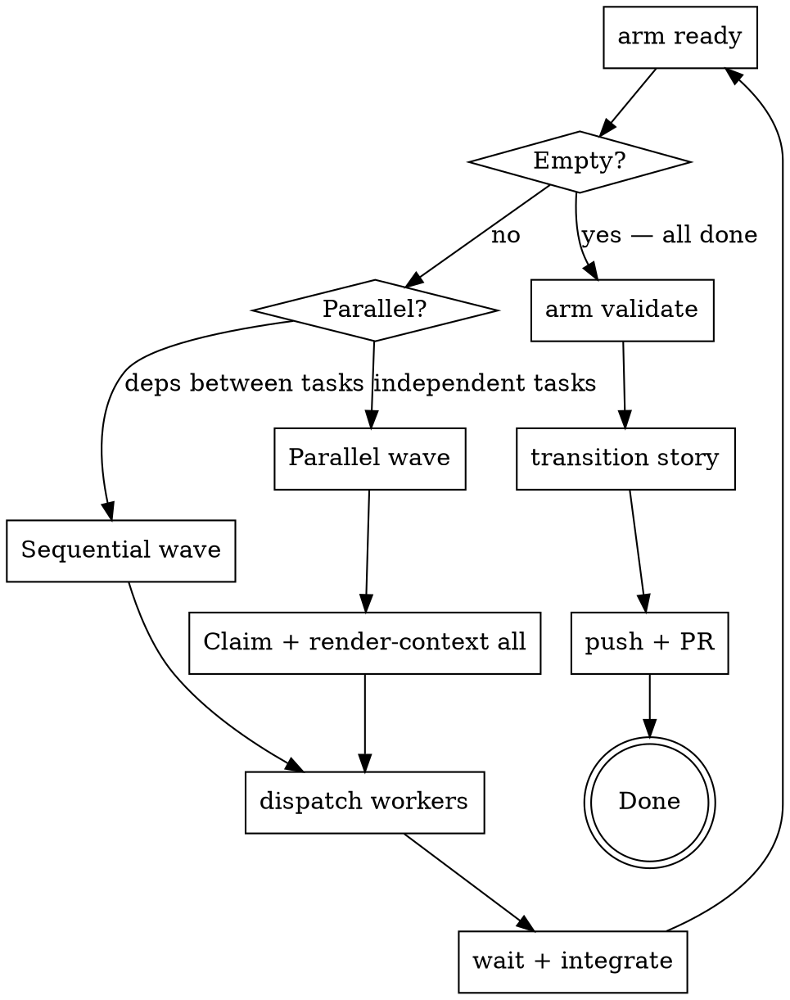

# Armature Coordinator

The coordinator manages execution flow — it does not implement features itself.
Its job is to survey the story DAG, dispatch workers for each wave of ready tasks,
and close the story when all tasks are done.

## Prerequisites

1. If `arm` is not found, stop and resolve this before proceeding.

2. **Worker identity required.** Run `arm worker-init` once per clone before claiming any tasks:
   ```bash
   arm worker-init --check || arm worker-init
   ```
   `arm claim` calls `resolveWorkerAndLog`, which fails with "worker not initialized" if no worker ID is set in git config.

3. Understand the story DAG before dispatching. Run:
   ```
   arm list --parent STORY-ID          # all tasks + statuses
   arm list --status blocked           # diagnose any blockers
   arm doctor                          # repo health check
   ```
   Fix any `doctor` errors before claiming work.

## DAG Hygiene Mandate

**`arm validate` and `arm doctor` must exit clean at all times.** This is non-negotiable.

Before dispatching any worker and after each wave completes, run:
```bash
arm validate       # zero ERRORs; all issues cited
arm doctor        # zero errors; no broken refs, orphaned ops, or cycles
```

If either exits non-zero, stop. Fix the reported issues before proceeding. Treat DAG decay the same way you treat failing tests — it is a blocker, not a warning to ignore.

Warnings from other stories must be resolved, not ignored. If `arm doctor` reports a D1 (commits referencing non-done issues) or D2 (stale claims) from unrelated work, clean them up before starting your coordination wave. DAG health is cumulative.

---

## The Coordinator Loop



## Step-by-Step

### 1. Survey the Story and Create a Feature Branch

```bash
arm list --parent STORY-ID
arm doctor
git checkout -b feat/STORY-ID   # create the story branch NOW, before any worker is dispatched
```

Identify which tasks are `open` and which have `blocked_by` dependencies. Group
tasks into waves — tasks within the same wave have no dependencies on each other
and can run in parallel. Tasks in different waves must run sequentially.

**Create the feature branch before dispatching any worker.** All workers commit
to this branch. If workers are dispatched without a branch, they default to
whatever branch the repo is on — typically `main` — and the story cannot be
reviewed via PR.

### 2. Find Ready Work

```bash
arm ready                              # unblocked, unclaimed tasks
```

If `arm ready` returns nothing and not all tasks are `done`, check for
dependency cycles or stalled in-progress tasks:
```bash
arm ready --explain                    # why each open task is NOT ready (blocked/claimed/missing dep)
arm list --status in-progress          # claims that may have expired
arm list --status blocked              # diagnose blockers
```

`arm ready --explain` prints a per-task diagnosis for every open task that
did not make it into the ready queue. Use it as the first step whenever the
queue looks unexpectedly empty.

### 3. Record Wave Manifest

Before dispatching any worker, record the wave manifest so the verification gate
has a stable baseline to diff against:

```bash
WAVE_TASK_IDS="TASK-A TASK-B ..."      # exact IDs in dispatch order
WAVE_BASE_SHA=$(git rev-parse HEAD)    # commit HEAD at wave start
WAVE_BRANCH=$(git rev-parse --abbrev-ref HEAD)  # story feature branch

# Classify wave type (determines which verification profile to run)
WAVE_TYPE=docs-skill-only              # default; promoted below if code files present
```

**Wave type auto-promotion rule:** inspect the ready-task scope fields. If any
task touches files matching `*.go`, `go.mod`, `go.sum`, `Makefile`, `cmd/**`,
or `internal/**` outside of `internal/skillsembed/`, set `WAVE_TYPE=code`.
A wave is docs-skill-only only when every changed file is a `SKILL.md`,
`references/*.md`, or other non-compiled documentation.

```bash
# Collect scope files from arm render-context output for each task in WAVE_TASK_IDS,
# or use `git diff --name-only "$WAVE_BASE_SHA"..HEAD` after workers return.
# Example: auto-promote based on task scope fields before dispatch:
WAVE_SCOPE_FILES=$(arm ready --parent STORY-ID | python3 -c "import sys,json; [print(f) for t in json.load(sys.stdin) for f in t.get('scope',[])]")

if echo "$WAVE_SCOPE_FILES" | grep -E '\.(go|mod|sum)$' | grep -q . || \
   echo "$WAVE_SCOPE_FILES" | grep -E '^(Makefile|cmd/|internal/)' | grep -qvE 'internal/skillsembed'; then
    WAVE_TYPE=code
fi
```

### 4. Dispatch Workers

For each wave of ready tasks:

1. Claim and get context for each task:
   ```bash
   arm claim TASK-ID --ttl <minutes>
   arm render-context TASK-ID --format agent
   ```
   Set `--ttl` to exceed your expected worker runtime. Default is 60 minutes; use
   `--ttl 240` or higher for complex tasks. If the TTL expires while a worker is
   still running, the claim becomes stale and another coordinator may re-dispatch
   the same task. Workers send periodic heartbeats (`arm heartbeat TASK-ID`) to
   reset the TTL — the worker skill handles this — but the coordinator's initial
   TTL must cover the time until the first heartbeat.

2. Dispatch each task to a worker agent using your platform's agent dispatch
   capability. Pass the full `render-context` output as the task specification.

3. For parallel waves, assign each worker a log slot before dispatch:
   ```bash
   export ARM_LOG_SLOT=<slot-number>
   ```

See [Dispatch Protocol](#dispatch-protocol) below for the full worker prompt format.

### 5. Parallel Dispatch (independent tasks in one wave)

Pre-claim all tasks in the wave, then dispatch workers concurrently. Each worker:
1. receives the pre-claimed issue context
2. implements and transitions to `done`
3. does NOT run `arm claim` again

Claim collisions are handled at pre-claim time by the coordinator.

---

## Dispatch Protocol

Each worker's context package must contain:

0. **Skill invocation (VERY FIRST instruction):**
   ```
   You are an armature worker. Invoke the `armature-worker` skill via the Skill tool before proceeding.
   ```
   This must appear before everything else — the skill loads the worker's
   operating procedure and pre-flight checks.

1. **Log slot (second instruction, before any `arm` command):**
   ```
   Before running any arm command, run: export ARM_LOG_SLOT=<assigned-slot>
   ```
   This must be the second line of the worker's prompt — immediately after
   the skill invocation.

2. **Full `render-context` output** — this is the worker's complete task spec.
   Do not summarize it; pass it verbatim.

3. **Pre-claimed notice** — tell the worker the issue is already claimed and it
   must NOT run `arm claim` again:
   ```
   This issue has been pre-claimed. Do NOT run `arm claim`. Do NOT run `arm worker-init`.
   ```

4. **Repository location:**
   ```
   Working directory: /path/to/repo
   ```

5. **Branch** — pass the story feature branch name so the worker checks it out
   before making any commits:
   ```
   Working branch: feat/STORY-ID  — run `git checkout feat/STORY-ID` before committing.
   ```

6. **Commit instruction** — instruct the worker to stage files explicitly using
   the task's `scope` field, not `git commit -am`:
   ```
   Commit: git add <each file listed in scope> && git commit -m "feat(ISSUE-ID): ..."
   ```

> **Background agent Bash limitation:** Background agents dispatched without an
> active terminal session cannot inherit the parent session's Bash permissions.
> Shell commands will block silently, causing the worker to hang indefinitely.
> To avoid this, prefer:
> - **Direct implementation** — have the coordinator implement small, well-scoped
>   tasks itself rather than dispatching a background agent.
> - **Foreground worktrees** — create a git worktree manually and run the worker
>   in a foreground terminal session so it inherits Bash permissions.

---

## After Workers Return

Run this integration checklist after each wave completes:

### a. Check task status
```bash
arm list --parent STORY-ID            # confirm all wave tasks are done
arm list --status in-progress         # any stragglers?
```

### a.1. Worker Recovery — Unkept `arm transition`

If a worker returned but their task remains `in-progress` or `done` without running `arm transition` (e.g., the worker forgot or the agent timed out), manually transition the task:

```bash
# List all tasks still in-progress or done
arm list --parent STORY-ID --format json | grep -E '"status":\s*"(in-progress|done)"'

# For each task that should be transitioned, manually run:
arm transition TASK-ID --to done --outcome "CONCRETE_OUTCOME_DESCRIPTION"
```

The recovery step:
1. **Identify the gap** — run `arm list --parent STORY-ID` and look for tasks with `"status": "in-progress"` or `"status": "done"` that do not appear in the wave manifest or were not marked `merged` in step (c) below.
2. **Understand what the worker did** — check the commit log for `TASK-ID` commits and review the scope files modified. Use `git diff` to confirm the work is complete.
3. **Write a concrete outcome** — do not re-use generic phrases like "Done" or "Completed". Reference specific files changed, tests added, or commands verified. Example: `"Implemented TokenParser.Parse() method; all 8 token types pass new tests; coverage 82%"`.
4. **Transition manually** — run `arm transition TASK-ID --to done --outcome "..."` with the specific outcome. This unblocks dependent tasks and prepares the issue for merge validation.

This is common when workers return from background dispatch without explicit handoff, or when TTL expiration causes a race with the heartbeat mechanism. Recovery is safe — `arm transition` is idempotent once an issue is already `done`.

### a.2. Semantic Review (Reviewer Dispatch)

For each task that completed in the wave, dispatch semantic conformance review:

1. **Prepare the review bundle** — capture the issue contract and delivery diff:
   ```bash
   REVIEW_BUNDLE=$(arm review prepare --issue TASK-ID \
     --base "$WAVE_BASE_SHA" --head HEAD)
   ```
   This creates a JSON bundle containing the issue's acceptance criteria, scope, and the diff of changed files.

2. **Dispatch the armature-reviewer agent** — pass the bundle to a reviewer subagent:
   ```
   Dispatch armature-reviewer with input: $REVIEW_BUNDLE
   ```
   The reviewer assesses whether the delivery conforms to the issue contract (acceptance criteria, scope adherence, code quality). Returns a `ConformanceAssessment` with a structured rating (green/yellow/red).

3. **Record the assessment** — persist the reviewer's findings:
   ```bash
   arm review record --issue TASK-ID --assessment <result.json>
   ```
   This links the assessment to the issue and updates its review status. Red ratings may block further wave progression until remediated.

**Note:** The reviewer checks *semantic conformance* to the contract — whether the code solves the stated problem cleanly. This is independent of the auditor's checks (citation coverage, repo health). Both gates must pass before story sign-off.

### b. Check for scope conflicts and merge conflicts

If workers operated in separate git worktrees or branches, merge them into the
story feature branch now. Resolve any conflicts before proceeding.

### c. Mark completed tasks merged

For every task that finished in the wave, run:

```bash
arm merged --issue TASK-ID
```

This promotes each completed task from `done` to `merged` so dependent work can
unblock cleanly before the next wave begins.

### d. Wave Verification Gate

After confirming all wave tasks are `done`, run the verification gate against the
wave manifest recorded in step 3 before dispatch.

**Terminal sanity check:**
```bash
echo "Wave: $WAVE_TASK_IDS"
echo "Base SHA: $WAVE_BASE_SHA"
echo "Branch: $WAVE_BRANCH"
echo "Wave type: $WAVE_TYPE"
```
If any variable is unset, stop — the manifest was not recorded before dispatch.
Reconstruct it from `arm list --status done` and `git log` before proceeding.

**Determine changed-file set:**
```bash
CHANGED_FILES=$(git diff --name-only "$WAVE_BASE_SHA"..HEAD)
```

**Auto-promote wave type:**
```bash
if echo "$CHANGED_FILES" | grep -E '\.(go|mod|sum)$' | grep -q . || \
   echo "$CHANGED_FILES" | grep -E '^(Makefile|cmd/|internal/)' | grep -qvE 'internal/skillsembed'; then
    WAVE_TYPE=code
fi
```

**Code profile** (run when `WAVE_TYPE=code`):
```bash
go build ./...   # compilation gate
make check       # lint + test + coverage-check + mutate + validate-skills + build
arm validate --quiet                                    # citation integrity
arm doctor                                              # repo health
```

If `go build` fails and `make` is unavailable, fall back to:
```bash
go run ./cmd/armature --help   # confirms the binary compiles
```

**Docs-skill-only profile** (run when `WAVE_TYPE=docs-skill-only`):
```bash
make validate-skills   # skills must reference arm, not install steps
arm validate --quiet   # citation integrity
arm doctor             # repo health
```

If any `*.go`, `go.mod`, `go.sum`, `Makefile`, `cmd/`, or `internal/` file
(outside `internal/skillsembed/`) appears in `$CHANGED_FILES`, auto-promote to
the code profile and re-run.

**Bounded remediation (2 attempts max):**

- **Attempt 1:** Fix reported failures. Be strict — address every error and
  warning before re-running the gate.
- **Attempt 2:** If failures persist, escalate: add an `arm note` on the story
  describing the blocker, do not transition, and surface the issue to the user
  before proceeding to the next wave.

Do not proceed to the next wave or story transition if the gate is red after
2 remediation attempts.

### e. Check citation coverage
```bash
arm validate
```

If `validate` shows `uncited node: ID`, run:
```bash
arm source-link --issue ID --source SOURCE-UUID   # if a source doc exists
# or
arm accept-citation --issue ID --ci               # if no source, mark as self-citing
```

### f. Clean up worktrees

If workers used git worktrees, remove them after their branches are merged:

```bash
git worktree list
git worktree remove <path> --force
git branch -d <worker-branch>
```

### g. Continue to next wave
```bash
arm ready    # next wave should now be unblocked
```

---

## Story Completion

When `arm ready` returns empty and all tasks are `done`:

### 1. Run the Auditor (pre-merge gate)

Dispatch the **armature-auditor** skill as a subagent before any story transition.
The auditor is a five-step pre-merge gate — it must give all-clear before you proceed.

**Invoke via the `Skill` tool:**
```
Skill("armature-auditor")
```

The auditor checks:
1. Citation integrity (`arm validate` — zero ERRORs, `COVERAGE: N/N cited`)
2. Source freshness (`arm sources verify` — zero MISSING)
3. Outcome quality (concrete outcomes against acceptance criteria)
4. Scope overlap (`arm validate --strict` — zero overlap warnings)
5. Repo health (`arm doctor --strict` — exit zero)

**Do not proceed to step 2 until the auditor reports all five checks green.**

### 2. Transition the story
```bash
arm transition STORY-ID --to done --outcome "brief summary of what was delivered"
```

### 3. Commit armature ops (single-branch mode only)

```bash
git status
git add .armature/ && git commit -m "chore(STORY-ID): sync armature state"
```

In **dual-branch mode**, ops are automatically committed to the `_armature` branch.

### 4. Push and open PR
```bash
git push -u origin HEAD
# Open a PR targeting your main/base branch
# PR title: the story title
# PR body: list each task ISSUE-ID and its one-line outcome
```

**One PR per story.**

---

## Common Failure Modes

| Failure | Cause | Fix |
|---|---|---|
| Parallel agents share one log, attribution lost | Forgot to embed `ARM_LOG_SLOT` in each agent's prompt | Include `export ARM_LOG_SLOT=<slot>` as the first instruction in each agent's prompt before dispatch |
| Build breaks after merging parallel branches | Skipped integration verification | After each wave, run `make check` before claiming the next wave |
| `arm transition STORY-ID --to done` errors with uncited nodes | Story transitioned before all issues were cited | Run `arm validate`; for each `uncited node: ID`, run `arm source-link` or `arm accept-citation --ci`; then retry transition |
| Armature ops not committed | Forgot mop-up commit before push | After story transition, run `git status`; if `.armature/` has changes, commit them (single-branch mode only) |
