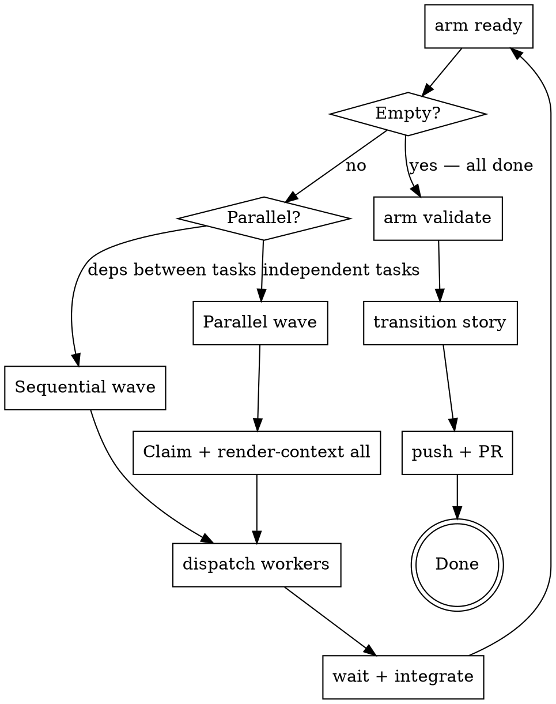

# Coordinator Loop

Load this when surveying a story or explaining dispatch order. The live procedure stays in `SKILL.md`.

```dot
digraph coordinator_loop {
    "arm ready" [shape=box];
    "Empty?" [shape=diamond];
    "Parallel?" [shape=diamond];
    "Sequential wave" [shape=box];
    "Parallel wave" [shape=box];
    "Claim + render-context all" [shape=box];
    "dispatch workers" [shape=box];
    "wait + integrate" [shape=box];
    "arm validate" [shape=box];
    "transition story" [shape=box];
    "push + PR" [shape=box];
    "Done" [shape=doublecircle];

    "arm ready" -> "Empty?";
    "Empty?" -> "arm validate" [label="yes — all done"];
    "Empty?" -> "Parallel?" [label="no"];
    "Parallel?" -> "Sequential wave" [label="deps between tasks"];
    "Parallel?" -> "Parallel wave" [label="independent tasks"];
    "Sequential wave" -> "dispatch workers";
    "Parallel wave" -> "Claim + render-context all";
    "Claim + render-context all" -> "dispatch workers";
    "dispatch workers" -> "wait + integrate";
    "wait + integrate" -> "arm ready";
    "arm validate" -> "transition story";
    "transition story" -> "push + PR";
    "push + PR" -> "Done";
}
```
