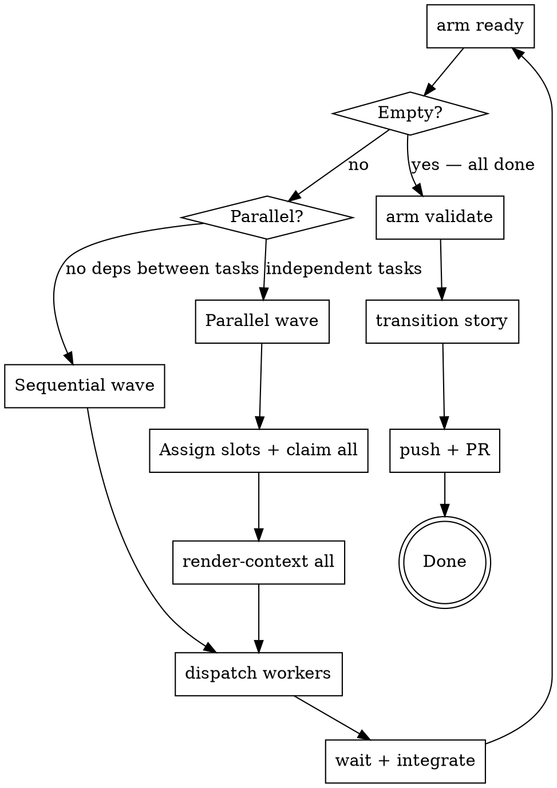

<!-- CANONICAL SOURCE: edit this file, not .claude/skills/armature-coordinator/SKILL.md — run `make skill` to regenerate the deployed copy -->

# Armature Coordinator Loop

The coordinator manages execution flow — it does not implement features itself.
Its job is to find ready work, assemble context, dispatch workers, verify their
output, and close the story.

## Prerequisites

1. `arm` must be on your PATH. Run `make install` from the armature repo root if it isn't:
   ```
   make install   # installs to ~/.local/bin/arm
   ```

2. **No worker identity required.** The coordinator skips `arm worker-init`.
   Orchestrator ops (claims, story transitions) go to the plain `<worker-id>.log`;
   if no worker ID is set, armature uses a fallback. Only workers need an identity.

3. Understand the story DAG before dispatching. Run:
   ```
   arm list --parent STORY-ID          # all tasks + statuses
   arm list --status blocked           # diagnose any blockers
   arm doctor                          # repo health check
   ```
   Fix any `doctor` errors before claiming work.

## The Coordinator Loop



## Step-by-Step

### 1. Survey the Story and Create a Feature Branch

```bash
arm list --parent STORY-ID
arm doctor
git checkout -b feat/STORY-ID   # create the story branch NOW, before any worker is dispatched
```

Identify which tasks are `open` and which have `blocked_by` dependencies. Group
tasks into waves — tasks within the same wave have no dependencies on each other
and can run in parallel. Tasks in different waves must run sequentially.

**Create the feature branch before dispatching any worker.** All workers commit
to this branch. If workers are dispatched without a branch, they default to
whatever branch the repo is on — typically `main` — and the story cannot be
reviewed via PR.

### 2. Find Ready Work

```bash
arm ready                              # unblocked, unclaimed tasks
arm ready --assigned-to WORKER-ID      # verify a pre-assignment wave
```

If `arm ready` returns nothing and not all tasks are `done`, check for
dependency cycles or stalled in-progress tasks:
```bash
arm ready --explain                    # why each open task is NOT ready (blocked/claimed/missing dep)
arm list --status in-progress          # claims that may have expired
arm list --status blocked              # diagnose blockers
```

`arm ready --explain` prints a per-task diagnosis for every open task that
did not make it into the ready queue. Use it as the first step whenever the
queue looks unexpectedly empty.

### 3. Sequential Dispatch (one task at a time)

Use sequential dispatch when tasks have ordering dependencies or shared-file
scope. For each task:

```bash
arm claim --issue TASK-ID
arm render-context --issue TASK-ID --budget 4000
```

Then dispatch a single worker agent with the context package (see
[Dispatch Protocol](#dispatch-protocol) below). Wait for the worker to return
before claiming the next task.

### 4. Parallel Dispatch (independent tasks in one wave)

Use parallel dispatch for tasks with no dependencies between them.

**a. Assign log slots and pre-assign workers (optional but recommended):**
```bash
arm assign --issue T1-ID --worker WORKER-A
arm assign --issue T2-ID --worker WORKER-B
```

**b. Claim all tasks in the wave:**
```bash
arm claim --issue T1-ID
arm claim --issue T2-ID
```

**c. Render context for each:**
```bash
arm render-context --issue T1-ID --budget 4000
arm render-context --issue T2-ID --budget 4000
```

**d. Dispatch all workers concurrently** — include the slot and full context in
each prompt (see [Dispatch Protocol](#dispatch-protocol) and
[Log Slots](#log-slots-for-parallel-dispatch) below).

**e. Wait for all workers to return before proceeding.**

**f. Verify and integrate** (see [After Workers Return](#after-workers-return)).

---

## Dispatch Protocol

Each worker's context package must contain:

0. **Skill invocation (VERY FIRST instruction):**
   ```
   You are an armature worker. Invoke the `armature-worker` skill via the Skill tool before proceeding.
   ```
   This must appear before everything else — the skill loads the worker's
   operating procedure and pre-flight checks. Workers that skip this step
   may miss critical setup steps or validations.

1. **Log slot (second instruction, before any `arm` command):**
   ```
   Before running any arm command, run: export ARM_LOG_SLOT=<assigned-slot>
   ```
   This must be the second line of the worker's prompt — immediately after
   the skill invocation and before any other instructions. See
   [Log Slots](#log-slots-for-parallel-dispatch) for why.

2. **Full `render-context` output** — this is the worker's complete task spec.
   Do not summarize it; pass it verbatim.

3. **Pre-claimed notice** — tell the worker the issue is already claimed and it
   must NOT run `arm claim` again:
   ```
   This issue has been pre-claimed. Do NOT run `arm claim`. Do NOT run `arm worker-init`.
   ```

4. **Repository location:**
   ```
   Working directory: /path/to/repo
   ```

5. **Branch** — pass the story feature branch name so the worker checks it out
   before making any commits:
   ```
   Working branch: feat/STORY-ID  — run `git checkout feat/STORY-ID` before committing.
   ```

6. **Commit instruction** — instruct the worker to stage files explicitly using
   the task's `scope` field, not `git commit -am` (which silently skips new files):
   ```
   Commit: git add <each file listed in scope> && git commit -m "feat(ISSUE-ID): ..."
   ```

**Dispatch using your platform's agent dispatch capability** — the exact tool
or API call depends on your runtime. The content above is what matters; the
mechanism is platform-specific.

---

## Log Slots for Parallel Dispatch

When multiple agents run concurrently, they each write ops to `.armature/`.
Without log slots, all agents write to the same log file, causing races and
losing per-agent attribution.

**How slots work:**

- Each agent sets `ARM_LOG_SLOT` before its first `arm` command.
- Ops go to `<worker-id>~<slot>.log` instead of `<worker-id>.log`.
- The coordinator's own shell must have `ARM_LOG_SLOT` **unset** so its ops
  (claims, story transitions) land in the plain `<worker-id>.log`.

**Assigning slots:**

Use the short task ID or a single letter as the slot:

| Agent | Task | Slot |
|---|---|---|
| Worker A | T1-ID | `t1` |
| Worker B | T2-ID | `t2` |
| Worker C | T3-ID | `t3` |

**Critical:** When dispatching via an AI platform's native agent tool (not a
shell subprocess), each agent runs in its own isolated shell. The coordinator's
`export ARM_LOG_SLOT=...` is never inherited. The slot **must** be embedded
verbatim as the first instruction in each agent's prompt:

```
Before running any arm command, run: export ARM_LOG_SLOT=t1
```

**Rules:**
- Coordinator always runs with `ARM_LOG_SLOT` unset.
- Each parallel agent sets a distinct slot before any `arm` call.
- Slot names must be unique within a batch — reusing a slot defeats the purpose.
- Slot log files are committed alongside code, just like the plain log.

---

## After Workers Return

Run this integration checklist after each wave completes:

### a. Check task status
```bash
arm list --parent STORY-ID            # confirm all wave tasks are done
arm list --status in-progress         # any stragglers?
```

### b. Check for scope conflicts and merge conflicts

If workers operated in separate git worktrees or branches, merge them into the
story feature branch now. Resolve any conflicts before proceeding. Check for
files that were modified by multiple workers.

### c. Verify build integrity
```bash
make check    # or the repo's equivalent: lint, tests, coverage
```

Do not proceed to the next wave or story close if the build is red.

### d. Check citation coverage
```bash
arm validate
```

Every issue that was touched should appear as cited. If `validate` shows
`uncited node: ID`, run:
```bash
arm source-link --issue ID --source SOURCE-UUID   # if a source doc exists
# or
arm accept-citation --issue ID --ci               # if no source, mark as self-citing
```

Repeat until `arm validate` shows no errors.

### e. Continue to next wave
```bash
arm ready    # next wave should now be unblocked
```

Repeat the loop from step 2.

---

## Story Completion

When `arm ready` returns empty and all tasks are `done`:

### 1. Run the Auditor (pre-merge gate)

Dispatch the **armature-auditor** skill as a subagent before any story transition.
The auditor is a five-step pre-merge gate — it must give all-clear before you
proceed.

**Invoke via the `Skill` tool:**
```
Skill("armature-auditor")
```

The auditor checks, in order:
1. Citation integrity (`arm validate` — zero ERRORs, `COVERAGE: N/N cited`)
2. Source freshness (`arm sources verify` — zero MISSING)
3. Outcome quality (concrete outcomes against acceptance criteria for each done task)
4. Scope overlap (`arm validate --strict` — zero overlap warnings)
5. Repo health (`arm doctor --strict` — exit zero)

**Do not proceed to step 2 until the auditor reports all five checks green.**
If the auditor flags issues, return them to the relevant workers for remediation,
then re-run the auditor before continuing.

### 2. Transition the story
```bash
arm transition STORY-ID --to done --outcome "brief summary of what was delivered"
```

`arm transition` will error if any uncited issues remain — the auditor in step 1
should have caught this.

### 3. Commit armature ops (single-branch mode only)

In single-branch mode, story and epic transitions generate ops that need a
mop-up commit:
```bash
git status
git add .armature/ && git commit -m "chore(STORY-ID): sync armature state"
```

In **dual-branch mode** (`git config --local armature.mode` returns `dual-branch`),
ops are automatically committed to the `_armature` branch. Omit `.armature/` from
the code commit; include only code files if any remain unstaged.

### 4. Push and open PR
```bash
git push -u origin HEAD
# Open a PR targeting your main/base branch
# PR title: the story title
# PR body: list each task ISSUE-ID and its one-line outcome
```

**One PR per story** — not per task (too many small PRs), not per epic (too
large to review). Story-level PRs give reviewers clear scope.

**CI and tag-push note:** If your CI pipeline triggers on tag pushes as well
as branch pushes, story feature branches (e.g. `feat/STORY-ID`) will not
accidentally fire tag-based workflows as long as your CI config uses a
`branches:` filter. Example for GitHub Actions:

```yaml
on:
  push:
    branches:
      - main
      - 'feat/**'
```

Without a `branches:` filter a `git push --tags` can trigger branch-push
workflows unexpectedly. If you see spurious CI runs after tagging, add or
tighten the `branches:` filter in your workflow file.

---

## Querying JSON Output

Most `arm` commands emit newline-delimited JSON. Use `grep` for quick
field extraction without requiring `jq`:

```bash
# Extract a single field from each object
arm list --parent STORY-ID | grep -o '"status":"[^"]*"'

# Filter objects where a field matches a value
arm list --parent STORY-ID | grep '"status":"done"'

# Count matches
arm list --parent STORY-ID | grep -c '"status":"done"'

# Extract IDs of all blocked tasks
arm list --status blocked | grep -o '"id":"[^"]*"'

# Show title alongside status for a quick overview
arm list --parent STORY-ID | grep -o '"id":"[^"]*"\|"title":"[^"]*"\|"status":"[^"]*"'
```

These patterns work in any shell without additional tooling. If `jq` is
available you can use it for more complex queries, but `grep` is sufficient
for the common coordinator workflow.

---

## Command Reference

```bash
# Surveying work
arm ready                              # unblocked, unclaimed tasks
arm ready --assigned-to WORKER-ID      # tasks pre-assigned to a specific worker
arm list --status blocked              # diagnose blockers
arm list --status in-progress          # in-flight claims
arm list --parent STORY-ID             # all tasks in a story

# Assignment (pre-wire before dispatching)
arm assign --issue ID --worker WORKER-ID   # pre-assign (does not claim)
arm unassign --issue ID                     # release assignment

# Claiming and context
arm claim --issue ID [--ttl 120]            # claim (marks in-progress, sets TTL)
arm render-context --issue ID [--budget 4000]  # assemble full task context

# Validation and story close
arm validate                    # citation coverage + source UUID integrity
arm validate --ci               # exit non-zero on errors (for CI use)
arm transition ID --to done --outcome "..."   # close task or story
arm doctor                      # repo health check
arm doctor --strict             # warnings as errors

# Monitoring
arm workers                     # worker activity status

# Scope maintenance (after file renames or deletions)
arm scope-rename <old> <new>    # rewrite path/prefix across all issue scopes
arm scope-delete <path>         # remove exact file path from all issue scopes
```

**Valid transition targets:** `in-progress`, `done`, `cancelled`, `blocked`

---

## Common Failure Modes

| Failure | Cause | Fix |
|---|---|---|
| Parallel agents share one log, attribution lost | Forgot to embed `ARM_LOG_SLOT` in each agent's prompt | Include `export ARM_LOG_SLOT=<slot>` as the first instruction in each agent's prompt before dispatch |
| Build breaks after merging parallel branches | Skipped integration verification | After each wave, run `make check` (or equivalent) on the merged result before claiming the next wave |
| `arm transition STORY-ID --to done` errors with uncited nodes | Story transitioned before all issues were cited | Run `arm validate`; for each `uncited node: ID`, run `arm source-link` or `arm accept-citation --ci`; then retry transition |
| Armature ops from story/epic transitions are never committed | Forgot mop-up commit before push | After story transition, run `git status`; if `.armature/` has changes, commit them with `git add .armature/ && git commit -m "chore(STORY-ID): sync armature state"` before pushing (single-branch mode only) |
