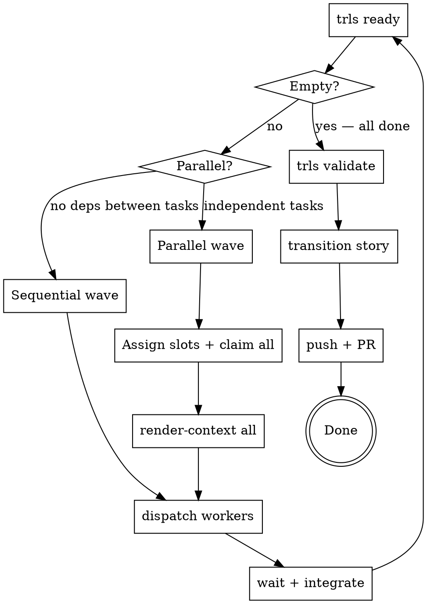

<!-- CANONICAL SOURCE: edit this file, not .claude/skills/trls-coordinator/SKILL.md — run `make skill` to regenerate the deployed copy -->

# Trellis Coordinator Loop

The coordinator manages execution flow — it does not implement features itself.
Its job is to find ready work, assemble context, dispatch workers, verify their
output, and close the story.

## Prerequisites

1. `trls` must be on your PATH. Run `make install` from the trellis repo root if it isn't:
   ```
   make install   # installs to ~/.local/bin/trls
   ```

2. **No worker identity required.** The coordinator skips `trls worker-init`.
   Orchestrator ops (claims, story transitions) go to the plain `<worker-id>.log`;
   if no worker ID is set, trellis uses a fallback. Only workers need an identity.

3. Understand the story DAG before dispatching. Run:
   ```
   trls list --parent STORY-ID          # all tasks + statuses
   trls list --status blocked           # diagnose any blockers
   trls doctor                          # repo health check
   ```
   Fix any `doctor` errors before claiming work.

## The Coordinator Loop



## Step-by-Step

### 1. Survey the Story and Create a Feature Branch

```bash
trls list --parent STORY-ID
trls doctor
git checkout -b feat/STORY-ID   # create the story branch NOW, before any worker is dispatched
```

Identify which tasks are `open` and which have `blocked_by` dependencies. Group
tasks into waves — tasks within the same wave have no dependencies on each other
and can run in parallel. Tasks in different waves must run sequentially.

**Create the feature branch before dispatching any worker.** All workers commit
to this branch. If workers are dispatched without a branch, they default to
whatever branch the repo is on — typically `main` — and the story cannot be
reviewed via PR.

### 2. Find Ready Work

```bash
trls ready                              # unblocked, unclaimed tasks
trls ready --assigned-to WORKER-ID      # verify a pre-assignment wave
```

If `trls ready` returns nothing and not all tasks are `done`, check for
dependency cycles or stalled in-progress tasks:
```bash
trls list --status in-progress          # claims that may have expired
trls list --status blocked              # diagnose blockers
```

### 3. Sequential Dispatch (one task at a time)

Use sequential dispatch when tasks have ordering dependencies or shared-file
scope. For each task:

```bash
trls claim --issue TASK-ID
trls render-context --issue TASK-ID --budget 4000
```

Then dispatch a single worker agent with the context package (see
[Dispatch Protocol](#dispatch-protocol) below). Wait for the worker to return
before claiming the next task.

### 4. Parallel Dispatch (independent tasks in one wave)

Use parallel dispatch for tasks with no dependencies between them.

**a. Assign log slots and pre-assign workers (optional but recommended):**
```bash
trls assign --issue T1-ID --worker WORKER-A
trls assign --issue T2-ID --worker WORKER-B
```

**b. Claim all tasks in the wave:**
```bash
trls claim --issue T1-ID
trls claim --issue T2-ID
```

**c. Render context for each:**
```bash
trls render-context --issue T1-ID --budget 4000
trls render-context --issue T2-ID --budget 4000
```

**d. Dispatch all workers concurrently** — include the slot and full context in
each prompt (see [Dispatch Protocol](#dispatch-protocol) and
[Log Slots](#log-slots-for-parallel-dispatch) below).

**e. Wait for all workers to return before proceeding.**

**f. Verify and integrate** (see [After Workers Return](#after-workers-return)).

---

## Dispatch Protocol

Each worker's context package must contain:

1. **Log slot (FIRST instruction):**
   ```
   Before running any trls command, run: export TRLS_LOG_SLOT=<assigned-slot>
   ```
   This must be the first line of the worker's prompt — before any other
   instructions. See [Log Slots](#log-slots-for-parallel-dispatch) for why.

2. **Full `render-context` output** — this is the worker's complete task spec.
   Do not summarize it; pass it verbatim.

3. **Pre-claimed notice** — tell the worker the issue is already claimed and it
   must NOT run `trls claim` again:
   ```
   This issue has been pre-claimed. Do NOT run `trls claim`. Do NOT run `trls worker-init`.
   ```

4. **Repository location:**
   ```
   Working directory: /path/to/repo
   ```

5. **Branch** — pass the story feature branch name so the worker checks it out
   before making any commits:
   ```
   Working branch: feat/STORY-ID  — run `git checkout feat/STORY-ID` before committing.
   ```

**Dispatch using your platform's agent dispatch capability** — the exact tool
or API call depends on your runtime. The content above is what matters; the
mechanism is platform-specific.

---

## Log Slots for Parallel Dispatch

When multiple agents run concurrently, they each write ops to `.issues/`.
Without log slots, all agents write to the same log file, causing races and
losing per-agent attribution.

**How slots work:**

- Each agent sets `TRLS_LOG_SLOT` before its first `trls` command.
- Ops go to `<worker-id>~<slot>.log` instead of `<worker-id>.log`.
- The coordinator's own shell must have `TRLS_LOG_SLOT` **unset** so its ops
  (claims, story transitions) land in the plain `<worker-id>.log`.

**Assigning slots:**

Use the short task ID or a single letter as the slot:

| Agent | Task | Slot |
|---|---|---|
| Worker A | T1-ID | `t1` |
| Worker B | T2-ID | `t2` |
| Worker C | T3-ID | `t3` |

**Critical:** When dispatching via an AI platform's native agent tool (not a
shell subprocess), each agent runs in its own isolated shell. The coordinator's
`export TRLS_LOG_SLOT=...` is never inherited. The slot **must** be embedded
verbatim as the first instruction in each agent's prompt:

```
Before running any trls command, run: export TRLS_LOG_SLOT=t1
```

**Rules:**
- Coordinator always runs with `TRLS_LOG_SLOT` unset.
- Each parallel agent sets a distinct slot before any `trls` call.
- Slot names must be unique within a batch — reusing a slot defeats the purpose.
- Slot log files are committed alongside code, just like the plain log.

---

## After Workers Return

Run this integration checklist after each wave completes:

### a. Check task status
```bash
trls list --parent STORY-ID            # confirm all wave tasks are done
trls list --status in-progress         # any stragglers?
```

### b. Check for scope conflicts and merge conflicts

If workers operated in separate git worktrees or branches, merge them into the
story feature branch now. Resolve any conflicts before proceeding. Check for
files that were modified by multiple workers.

### c. Verify build integrity
```bash
make check    # or the repo's equivalent: lint, tests, coverage
```

Do not proceed to the next wave or story close if the build is red.

### d. Check citation coverage
```bash
trls validate
```

Every issue that was touched should appear as cited. If `validate` shows
`uncited node: ID`, run:
```bash
trls source-link --issue ID --source SOURCE-UUID   # if a source doc exists
# or
trls accept-citation --issue ID --ci               # if no source, mark as self-citing
```

Repeat until `trls validate` shows no errors.

### e. Continue to next wave
```bash
trls ready    # next wave should now be unblocked
```

Repeat the loop from step 2.

---

## Story Completion

When `trls ready` returns empty and all tasks are `done`:

### 1. Final validation
```bash
trls validate   # must show COVERAGE: N/N cited with no ERROR lines
```
Resolve any uncited issues before continuing.

### 2. Repo health check
```bash
trls doctor --strict   # warnings as errors
```

### 3. Transition the story
```bash
trls transition STORY-ID --to done --outcome "brief summary of what was delivered"
```

`trls transition` will error if any uncited issues remain — run `trls validate`
first.

### 4. Commit trellis ops (single-branch mode only)

In single-branch mode, story and epic transitions generate ops that need a
mop-up commit:
```bash
git status
git add .issues/ && git commit -m "chore(STORY-ID): sync trellis state"
```

In **dual-branch mode** (`git config --local trellis.mode` returns `dual-branch`),
ops are automatically committed to the `_trellis` branch. Omit `.issues/` from
the code commit; include only code files if any remain unstaged.

### 5. Push and open PR
```bash
git push -u origin HEAD
# Open a PR targeting your main/base branch
# PR title: the story title
# PR body: list each task ISSUE-ID and its one-line outcome
```

**One PR per story** — not per task (too many small PRs), not per epic (too
large to review). Story-level PRs give reviewers clear scope.

---

## Command Reference

```bash
# Surveying work
trls ready                              # unblocked, unclaimed tasks
trls ready --assigned-to WORKER-ID      # tasks pre-assigned to a specific worker
trls list --status blocked              # diagnose blockers
trls list --status in-progress          # in-flight claims
trls list --parent STORY-ID             # all tasks in a story

# Assignment (pre-wire before dispatching)
trls assign --issue ID --worker WORKER-ID   # pre-assign (does not claim)
trls unassign --issue ID                     # release assignment

# Claiming and context
trls claim --issue ID [--ttl 120]            # claim (marks in-progress, sets TTL)
trls render-context --issue ID [--budget 4000]  # assemble full task context

# Validation and story close
trls validate                    # citation coverage + source UUID integrity
trls validate --ci               # exit non-zero on errors (for CI use)
trls transition ID --to done --outcome "..."   # close task or story
trls doctor                      # repo health check
trls doctor --strict             # warnings as errors

# Monitoring
trls workers                     # worker activity status
```

**Valid transition targets:** `in-progress`, `done`, `cancelled`, `blocked`

---

## Common Failure Modes

| Failure | Cause | Fix |
|---|---|---|
| Parallel agents share one log, attribution lost | Forgot to embed `TRLS_LOG_SLOT` in each agent's prompt | Include `export TRLS_LOG_SLOT=<slot>` as the first instruction in each agent's prompt before dispatch |
| Build breaks after merging parallel branches | Skipped integration verification | After each wave, run `make check` (or equivalent) on the merged result before claiming the next wave |
| `trls transition STORY-ID --to done` errors with uncited nodes | Story transitioned before all issues were cited | Run `trls validate`; for each `uncited node: ID`, run `trls source-link` or `trls accept-citation --ci`; then retry transition |
| Trellis ops from story/epic transitions are never committed | Forgot mop-up commit before push | After story transition, run `git status`; if `.issues/` has changes, commit them with `git add .issues/ && git commit -m "chore(STORY-ID): sync trellis state"` before pushing (single-branch mode only) |
