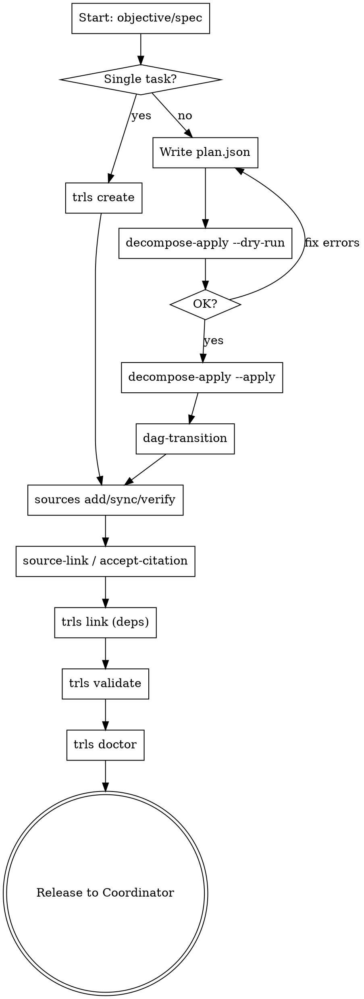

<!-- CANONICAL SOURCE: edit this file, not .claude/skills/trls-planner/SKILL.md — run `make skill` to regenerate the deployed copy -->

# Trellis Planner Loop

The Planner translates objectives and specifications into a well-structured DAG
of actionable work. The output is a validated, cited, dependency-resolved set of
issues ready for workers to claim.

## Prerequisites

- `trls` must be on your PATH. Run `make install` from the trellis repo root if
  it isn't:
  ```
  make install   # installs to ~/.local/bin/trls
  ```
- **Do NOT run `trls worker-init`** — the Planner does not require a worker
  identity. Skip that step entirely.
- Have a source document, spec, or design doc before you start. Every issue you
  create must be citable. If no source exists yet, write one first or be
  prepared to use `trls accept-citation` with a clear rationale.

## The Planner Loop



## Step-by-Step

### 1. Register Sources First

Register source documents **before** creating issues. This lets you link issues
at creation time rather than doing a remediation pass later.

```bash
trls sources add --url path/to/spec.md --title "Feature Spec" --type filesystem
trls sources sync       # fetch and fingerprint all registered sources
trls sources verify     # confirm all show OK (not MISSING)
```

If `trls sources verify` shows MISSING entries, re-run `trls sources sync` until
they resolve. Do not proceed with issue creation while sources are MISSING.

### 2. Create or Decompose

**For a single task:**
```bash
trls create --title "Task title" --type task --parent STORY-ID
```

Valid types: `task`, `feature`, `bug`, `story`

**For a full decomposition (most common):**

See the full workflow in the [Decompose-Apply Workflow](#decompose-apply-workflow)
section below.

### 3. Promote from Draft

After `decompose-apply`, all created issues are in `draft` state. Promote them
so workers can see them:

```bash
trls dag-transition --issue ROOT-ID   # promotes ROOT-ID and all children draft → verified
```

Workers cannot claim draft issues. Do not skip this step.

### 4. Link Issues to Sources

Every issue must be cited before `trls validate` will pass.

```bash
# Link each issue to a registered source
trls source-link --issue ISSUE-ID --source-id UUID

# If no source document exists for this issue
trls accept-citation --issue ISSUE-ID --rationale "No external spec; requirements captured in issue body" --ci
```

Do this at creation time — not as a post-hoc remediation pass. Citation debt
accumulates silently and blocks validation.

### 5. Resolve Dependencies

Identify scope overlaps and set blocking dependencies before releasing work.

```bash
trls link --source A --dep B    # A is blocked_by B; A runs after B completes
trls validate                   # scope overlap WARNINGs appear here; resolve each one
```

### 6. Validate and Release

```bash
trls validate --ci   # must exit 0 with no ERRORs; scope overlaps resolved
trls doctor          # repo health check (D1-D6); fix any errors
trls list --group    # final sanity check — all issues visible and in expected states
```

Only release to the Coordinator after both commands are clean.

---

## Writing Good Plan JSON

This section is critical. **Every task in the plan MUST have `dod`, `scope`, and
`acceptance` fields or `trls validate` will ERROR.**

### The Three Mandatory Fields

**`dod` — Definition of Done**

Describes what "complete" looks like. Must be concrete and verifiable by the
worker without asking the Planner.

- Good: `"The parser handles all five token types defined in spec §3.2 and returns typed AST nodes. All existing tests pass and new unit tests cover the added branches."`
- Bad: `"Done when it works"` — vague, not verifiable
- Bad: `"Implement the feature"` — restates the title, adds no information

**`scope` — Files Affected**

Lists the specific files this task modifies. Use the `(new)` suffix for files
that do not yet exist. Use precise paths, not vague descriptions.

- Good: `"cmd/parse/main.go, internal/ast/node.go (new), internal/ast/node_test.go (new)"`
- Bad: `"the parser files"` — worker cannot determine what to touch
- Bad: `"internal/"` — too broad, enables scope collisions

**`acceptance` — Verifiable Criteria**

JSON array of specific criteria the worker can verify mechanically. Each entry
should name a test, a command output, or an observable behavior.

- Good: `["TestParseTokenTypes passes", "make check green", "trls validate exits 0"]`
- Bad: `[]` — empty array provides no acceptance signal
- Bad: `["looks good"]` — not mechanically verifiable

### Complete Well-Formed Task Example

```json
{
  "id": "STORY-T1",
  "title": "Add token parser",
  "type": "task",
  "parent": "STORY-ID",
  "priority": "high",
  "blocked_by": [],
  "dod": "Parser handles all five token types from spec §3.2. Returns typed AST nodes. All existing tests pass; new tests cover added branches.",
  "scope": "cmd/parse/main.go, internal/ast/node.go (new), internal/ast/node_test.go (new)",
  "acceptance": [
    "TestParseTokenTypes passes",
    "TestParseEdgeCases passes",
    "make check green",
    "no new lint errors"
  ]
}
```

### Anti-Patterns to Avoid

| Anti-pattern | Problem | Fix |
|---|---|---|
| `"dod": "done when it works"` | Not verifiable | Describe the specific outcome |
| `"scope": "various files"` | Worker cannot self-scope | List every file path explicitly |
| `"acceptance": []` | No pass/fail signal | Name at least one test or command |
| `"scope": "internal/"` | Too broad, causes overlaps | Name the specific files |
| Missing `acceptance` field entirely | `trls validate` ERRORs | Add the field, even if `--example` omits it |

> **Note:** `trls decompose-apply --example` omits `acceptance` in its output.
> Always add it manually to every task in your plan JSON.

---

## Decompose-Apply Workflow

Use this for any work involving more than one or two tasks.

### 1. Inspect the Schema

```bash
trls decompose-apply --example
```

This prints a minimal plan JSON. Use it as a starting template but remember to
add `acceptance` to every task — it is omitted from the example output.

### 2. Write plan.json

Create a file (e.g. `plan.json`) following this structure:

```json
{
  "version": "1",
  "title": "Plan Title",
  "issues": [
    {
      "id": "STORY-T1",
      "title": "First task",
      "type": "task",
      "parent": "STORY-ID",
      "priority": "high",
      "blocked_by": [],
      "dod": "what done looks like — concrete and verifiable",
      "scope": "path/to/file.go, path/to/new_file.go (new)",
      "acceptance": ["TestFoo passes", "make check green"]
    },
    {
      "id": "STORY-T2",
      "title": "Second task",
      "type": "task",
      "parent": "STORY-ID",
      "priority": "normal",
      "blocked_by": ["STORY-T1"],
      "dod": "what done looks like",
      "scope": "path/to/other_file.go",
      "acceptance": ["TestBar passes", "make check green"]
    }
  ]
}
```

- `id` values in `blocked_by` must match `id` values in the plan
- `parent` must be an existing issue ID in the repo
- `type` values: `task`, `feature`, `bug`, `story`

### 3. Dry-Run First

```bash
trls decompose-apply --plan plan.json --dry-run
```

This validates the plan and prints what would be created without writing
anything. Fix any errors before proceeding.

Common dry-run errors:
- Missing required fields (`dod`, `scope`, `acceptance`)
- Unknown parent ID
- Duplicate `id` values in the plan
- Malformed `blocked_by` references

### 4. Apply the Plan

```bash
trls decompose-apply --plan plan.json
```

All issues are created in `draft` state.

### 5. Promote from Draft

```bash
trls dag-transition --issue STORY-ID   # promotes the story and all its tasks
```

Verify promotion:
```bash
trls list --parent STORY-ID   # all tasks should show status: open or in-progress
```

---

## Source Registration

Every issue must have a citation before `trls validate` passes. The two paths:

### Path A: Source document exists

```bash
# 1. Register the source (do this before creating issues)
trls sources add --url docs/design/feature-spec.md --title "Feature Spec" --type filesystem

# 2. Sync to fingerprint it
trls sources sync

# 3. Verify it shows OK
trls sources verify

# 4. Link each issue (get UUID from sources verify output)
trls source-link --issue ISSUE-ID --source-id UUID
```

### Path B: No source document exists

```bash
trls accept-citation --issue ISSUE-ID --rationale "Requirements captured in issue body; no external spec exists" --ci
```

Use a specific rationale — vague rationales like "no docs" are harder to audit
later.

### Rules

- Register sources **before** creating issues, not after.
- Do not leave any issue uncited. Check coverage with `trls validate`.
- If `trls validate` reports `uncited node: ID`, either `source-link` or
  `accept-citation` that issue before releasing to workers.
- If `trls validate` reports `unknown source: UUID`, the source UUID is not in
  the manifest — re-run `trls sources sync` then `trls sources verify`.

---

## Dependency Management

Use `trls link` to express ordering constraints between tasks.

```bash
trls link --source A --dep B    # A is blocked_by B (A runs after B completes)
trls unlink --source A --dep B  # remove a dependency
```

### When to Use `trls link`

- **Scope overlaps:** If two tasks touch the same file, one must run after the
  other. Run `trls validate` to surface scope overlap WARNINGs, then resolve
  each one with `trls link`.
- **Logical ordering:** Task A consumes the output of Task B (e.g. integration
  tests depend on the feature being implemented).
- **Avoiding collisions:** Tasks assigned to parallel workers must not have
  overlapping scope without an ordering dependency.

### Checking for Overlaps

```bash
trls validate    # scope overlap WARNINGs appear here
```

For each WARNING, decide which task runs first and add the link:
```bash
trls link --source LATER-TASK --dep EARLIER-TASK
trls validate    # re-run until all WARNINGs are resolved
```

---

## Release Checklist

Run this checklist before handing work off to the Coordinator.

1. **`trls validate`** — no ERRORs, citation coverage complete
   ```bash
   trls validate --ci   # exits non-zero on any error
   ```

2. **`trls doctor`** — repo health checks D1-D6 pass
   ```bash
   trls doctor          # or trls doctor --strict (warnings as errors)
   ```

3. **All issues promoted from draft**
   ```bash
   trls list --group    # no issues should appear in draft state
   ```

4. **All issues cited** — `trls validate` output shows `COVERAGE: N/N cited`

5. **Dependencies correct** — no scope overlap WARNINGs in `trls validate`

6. **Priorities set** — review `trls list --group` to confirm priorities reflect
   intended execution order

Do not release until all six checks pass.

---

## Common Failure Modes

| Failure | Symptom | Prevention |
|---|---|---|
| Tasks missing `dod`, `scope`, or `acceptance` | Workers cannot self-verify completion; `trls validate` ERRORs | Write all three fields for every task; use the complete example in this skill as a template |
| Issues created without source links | `trls validate` reports `uncited node: ID`; citation debt accumulates silently | Register sources first; `source-link` every issue at creation time |
| Scope overlaps not resolved with `trls link` | Workers collide on the same files; merge conflicts during story close | Run `trls validate` after decompose-apply; resolve every scope overlap WARNING before releasing |
| Draft issues not promoted | Workers see an empty ready queue; work never starts | Always run `trls dag-transition --issue ROOT-ID` after `decompose-apply` |

---

## Quick Reference

```bash
# Single issue creation
trls create --title "X" --type task --parent STORY-ID

# Decomposition
trls decompose-apply --example                         # inspect schema
trls decompose-apply --plan plan.json --dry-run        # preview without writing
trls decompose-apply --plan plan.json                  # apply the plan

# Draft promotion
trls dag-transition --issue ROOT-ID                    # promote root + all children

# Source management
trls sources add --url PATH --title "TEXT" --type filesystem
trls sources sync                                      # fetch and fingerprint
trls sources verify                                    # confirm all show OK
trls source-link --issue ID --source-id UUID           # link issue to source
trls accept-citation --issue ID --rationale "..." --ci # accept risk (no source)

# Dependency management
trls link --source A --dep B                           # A runs after B
trls unlink --source A --dep B                         # remove dependency

# Validation
trls validate                                          # graph + citation check
trls validate --ci                                     # exit non-zero on errors
trls doctor                                            # repo health check
trls doctor --strict                                   # warnings as errors
trls list --group                                      # grouped by status
trls list --parent STORY-ID                            # tasks under a story
```
