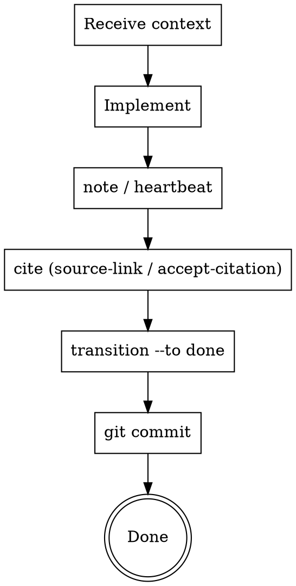

<!-- CANONICAL SOURCE: edit this file, not .claude/skills/trls-worker/SKILL.md — run `make skill` to regenerate the deployed copy -->

# Trellis Worker

A worker receives a pre-claimed task from the Coordinator, implements it, records
progress, and transitions the task to `done`.

## Prerequisites

`trls` must be on your PATH. Run `make install` from the trellis repo root if it isn't:

```
make install   # installs to ~/.local/bin/trls
```

If `trls` is not found, stop and resolve this before proceeding.

Run `worker-init` once per machine/clone — the worker ID persists in local git config
across sessions:

```
trls worker-init --check || trls worker-init
```

`--check` is a no-op if the ID is already set. Re-running `worker-init` without
`--check` generates a new UUID, which is almost never what you want.

> Workers receive task context from the Coordinator at dispatch time.
> For finding work, claiming issues, dispatching workers, and story-level PR:
> see the **trls-coordinator** skill.

## The Worker Flow



## Step-by-Step

### 1. Initialize
```
trls worker-init --check || trls worker-init
trls doctor
```

Run `trls doctor` to verify repo health (no broken parent refs, no orphaned ops,
no dependency cycles). Fix any errors before starting work.

### 2. Receive Task Context

The Coordinator dispatches you with a pre-claimed issue and the full output of
`trls render-context`. That output is your complete task specification — it
contains the issue description, definition of done, blocker outcomes, parent chain,
decisions, and notes.

**Do not open plan files. Do not read docs/superpowers/plans/. The render-context
output is sufficient.**

The issue is already claimed. Do NOT run `trls claim`. Do NOT run `trls worker-init`
again.

### 3. Record Progress

While implementing, record progress and decisions:

```
trls note ISSUE-ID --msg "..."
trls decision ISSUE-ID --topic X --choice Y --rationale Z
```

**Call `trls heartbeat ISSUE-ID` for any work taking more than a few minutes —
maximum once per minute.** Claims expire after the TTL; without periodic heartbeats
another worker may steal the claim. Issue heartbeat calls at natural checkpoints
(e.g. after each test run, after each file written).

### 4. Cite Every Issue Touched

Before completing work, cite every issue you touched or created:

```
trls source-link --issue ISSUE-ID --source SOURCE-UUID   # if a source doc exists
# or
trls accept-citation --issue ISSUE-ID --ci               # if no source exists
```

Do not leave issues uncited.

### 5. Complete and Commit

```
trls transition ISSUE-ID --to done --outcome "what was accomplished"
git add <code files...> .issues/   # always include .issues/ — ops must travel with code
git commit -m "feat(ISSUE-ID): brief description of what was implemented"
```

Record a concrete outcome. Commit immediately after the task — small focused commits
are easier to review.

**Pro-tip: Bundled Workflow**
To avoid forgetting `.issues/` or the commit, combine these into a single command:
```bash
trls transition ISSUE-ID --to done --outcome "..." && git add . .issues/ && git commit -m "feat(ISSUE-ID): ..."
```

**Always stage `.issues/` alongside code files.** Every `trls` command (note,
decision, heartbeat, transition) writes ops to `.issues/`. If you omit `.issues/`
from the commit, those ops are left behind and will not be delivered with the code.

**Dual-branch mode exception:** If `git config --local trellis.mode` returns
`dual-branch`, ops are automatically committed to the `_trellis` branch by
each `trls` command — they do **not** appear as pending changes in the code
worktree. **Omit `.issues/` from `git add`.** Including it stages stale data
from the code branch's (unused) `.issues/` copy and will fail the pre-commit
guard.

**Commit message format:** `<type>(<ISSUE-ID>): <description>`
Types: `feat`, `fix`, `refactor`, `test`, `docs`

**Branch discipline:** `trls transition --to done` will fail if you are on the
main or master branch (unless you use `--force`). The `--force` flag should only
be used in exceptional cases (e.g., emergency hotfixes to main).

## Valid Transition Targets

| Target | When |
|---|---|
| `done` | Work complete |
| `blocked` | Cannot proceed, external dependency |
| `cancelled` | Work abandoned |

**Valid status values use hyphens:** `in-progress`, `done`, `cancelled`, `blocked`. Underscores are rejected.

## Setting Your Log Slot

When the Coordinator dispatches you as part of a parallel wave, it will assign you
a log slot. Set it before running any `trls` command:

```
export TRLS_LOG_SLOT=<assigned-slot>
```

This ensures your ops go to a slot-specific log file and do not race with other
parallel workers. The Coordinator assigns slots — workers set the slot they are
given but do not assign slots to others.

## Batch Strategy (Advanced)

When a task involves a large number of files (e.g. refactoring 10+ files), do not
attempt to process them all in a single turn. This leads to incomplete work and
high token usage. Instead:

1.  **Build a Manifest:** Use `grep --names-only` or `glob` to find all files that
    need changes. Save this list to a temporary file or a note.
2.  **Process in Chunks:** Process the files in small batches (e.g. 3-5 files at a
    time).
3.  **Verify each Chunk:** Run tests/linting after each chunk to ensure no
    regressions were introduced.
4.  **Heartbeat:** Call `trls heartbeat ID` after each chunk.
5.  **Final Review:** Once all files are processed, run a final global check
    before transitioning the task to `done`.

## Common Mistakes

| Mistake | Fix |
|---|---|
| `trls: command not found` | Run `make install`, ensure `~/.local/bin` is on PATH |
| Reading plan files for task instructions | Use `render-context` output only |
| Using `in_progress` (underscore) | Use `in-progress` (hyphen) |
| Skipping `worker-init` on a fresh clone | Required once per clone — ops without worker ID will fail |
| Running `worker-init` every session | Generates a new UUID each time, creating phantom workers; use `--check` to verify instead |
| Running `trls claim` when dispatched by Coordinator | The Coordinator pre-claims the issue; do not re-claim |
| Skipping heartbeat on long tasks | Claim expires after TTL; other workers can steal it |
| Skipping commit after task | Small commits make review and revert tractable |
| Omitting `.issues/` from `git add` | Ops left behind, not delivered with code; always include `.issues/` in every commit (single-branch mode only) |
| Including `.issues/` in `git add` in dual-branch mode | Stages stale data; ops are already on `_trellis` branch — omit `.issues/` from code commits |
| Leave issues uncited | Run `trls source-link` or `trls accept-citation --ci` before returning |
| Repeating `transition` then `commit` manually | Use a bundled command: `trls transition ID ... && git add . .issues/ && git commit -m ...` |
| Transitioning to done while on main | `trls transition --to done` will fail on main/master branch — use feature branch or `--force` only in emergencies |
| Scope overlap WARNING on `trls validate` | Add `trls link --source ISSUE-A --dep ISSUE-B` so overlapping tasks execute serially, not in parallel |
| MISSING entries in `trls sources verify` | Run `trls sources sync` to fetch and fingerprint; re-run `trls sources verify` until all show OK |
